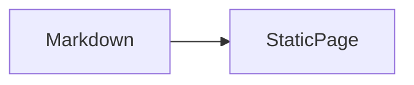

# Content Guide

## Location and URL

Create one Markdown file at `src/content/blog/<category>/<slug>.md`. It is published at `/{category}/{slug}/` when it is not a draft.

## Frontmatter

```yaml
---
title: "A clear Korean post title"
description: "A concise summary used in archives and metadata."
publishedAt: 2026-08-02
updatedAt: 2026-08-03 # optional
category: "web"
tags: ["astro", "markdown"]
draft: false # optional; true keeps the entry private
cover: "/images/example.svg" # optional
---
```

`title`, `description`, `publishedAt`, and `category` are required. `tags` defaults to an empty list. Use a non-empty lowercase route-safe category and a descriptive file name.

## Writing rules

- Write the post body in Korean unless a technical term is clearer in English.
- Use fenced language identifiers such as `ts`, `js`, `kotlin`, and `bash` for code blocks.
- Use standard Markdown images with files in `public/images/`, for example ``.
- Keep wide code blocks and tables readable on mobile; the shared prose styles provide horizontal scrolling.

## Mermaid

Use a fenced `mermaid` block. It becomes SVG during the static build.

````markdown

````

Run `npm run build` after adding or editing a diagram. Invalid Mermaid syntax intentionally fails the build.
