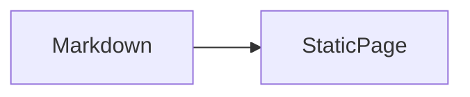
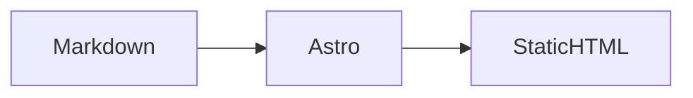

# Modern Developer Blog Implementation Plan

> **For agentic workers:** REQUIRED SUB-SKILL: Use `superpowers:subagent-driven-development` (recommended) or `superpowers:executing-plans` to implement this plan task-by-task. Steps use checkbox (`- [ ]`) syntax for tracking.

**Goal:** Deliver a responsive Astro developer blog on GitHub Pages with representative Markdown posts that correctly render code, tables, images, and Mermaid diagrams.

**Architecture:** Astro statically generates a reading-first site from a typed `blog` content collection. Shared layouts and components own responsive presentation; small utility functions derive archives and neighbouring posts. GitHub Actions validates pull requests and deploys `main` to GitHub Pages.

**Tech Stack:** Node.js 22, npm, Astro, TypeScript, Zod content schema, `remark-gfm`, `rehype-mermaid`, Shiki (Astro default), Playwright, GitHub Actions, GitHub Pages.

## Global Constraints

- Build a simple, modern, reading-first Korean developer blog; do not copy the WordPress layout.
- Keep `README.md` in Korean. All other repository documentation may be English.
- Preserve post detail URLs as `/{category}/{slug}/`.
- Do not migrate or add comments, search, RSS automation, multilingual support, or custom-domain DNS changes.
- First-release content comprises representative posts only; migrate other WordPress posts incrementally later.
- Mermaid must become build-time SVG; malformed Mermaid must fail validation or build.
- Verify representative content at desktop, tablet, and mobile breakpoints.
- Use signed commits only. If a signing passphrase is requested, stop the task and notify the user; never request or handle the passphrase.
- Commit exactly twice per day from 2026-07-24 through 2026-08-06. The approved design document is the first 2026-07-24 commit; this plan document is the second. Use actual local time for commits dated 2026-08-07 and later.
- Add a hook only after proposing its event, command, input, timeout, failure behavior, trust scope, and non-hook alternative, then receiving explicit user approval.

---

## File Structure

| Path | Responsibility |
| --- | --- |
| `package.json`, `.nvmrc`, `astro.config.mjs`, `tsconfig.json` | Toolchain, scripts, static-site configuration |
| `src/content.config.ts` | Typed Markdown collection and frontmatter schema |
| `src/lib/posts.ts` | Published-post sorting, archives, and adjacent-post lookup |
| `src/layouts/BaseLayout.astro` | HTML shell, global styles, header/footer composition |
| `src/layouts/PostLayout.astro` | Article metadata, body, tags, and adjacent navigation |
| `src/components/*.astro` | Small presentational components with one responsibility each |
| `src/pages/` | Route-level static pages and archive routes |
| `src/content/blog/` | Representative Markdown posts organized by category |
| `src/styles/global.css` | Design tokens, responsive styles, prose and rich-content rules |
| `public/images/` | Local editorial images used by representative content |
| `tests/`, `e2e/` | Utility and responsive rendering verification |
| `.github/workflows/` | Pull-request validation and Pages deployment |
| `AGENTS.md`, `ARCHITECTURE.md`, `docs/adr/`, `docs/content-guide.md` | Codex harness and enduring project knowledge |

## Commit Calendar

| Date | Commit 1 | Commit 2 |
| --- | --- | --- |
| 2026-07-24 | Approved design specification (already committed) | This implementation plan |
| 2026-07-25 | Astro toolchain | Korean README and ignore rules |
| 2026-07-26 | `AGENTS.md` | Architecture, ADRs, content guide |
| 2026-07-27 | Global design tokens | Header and footer components |
| 2026-07-28 | Base layout and home route | Reusable post card |
| 2026-07-29 | Content collection schema | Post utility tests and implementation |
| 2026-07-30 | GFM/code Markdown configuration | Mermaid build-time rendering and validation |
| 2026-07-31 | Post layout and post route | Category archive route |
| 2026-08-01 | Tag archive route | About and 404 pages |
| 2026-08-02 | Web representative post | Android representative post, image, and table |
| 2026-08-03 | JavaScript representative post | Responsive rich-content refinements |
| 2026-08-04 | Homepage breakpoint tests | Article breakpoint and Mermaid tests |
| 2026-08-05 | Pull-request validation workflow | GitHub Pages deployment workflow |
| 2026-08-06 | Sitemap, robots, metadata | Release verification guide and final checks |
| 2026-08-07+ | Actual-time commits only | Fixes or follow-up content after verification |

### Task 1: Commit the implementation plan

**Files:**
- Create: `docs/superpowers/plans/2026-08-07-modern-dev-blog-implementation.md`

- [ ] **Step 1: Self-review the document**

Run: `rg -n "TODO|TBD|FIXME|implement later|fill in details" docs/superpowers/specs docs/superpowers/plans --glob '!2026-08-07-modern-dev-blog-implementation.md'`

Expected: no matches.

- [ ] **Step 2: Commit the approved plan as the second 2026-07-24 commit**

Run:

```bash
git add docs/superpowers/plans/2026-08-07-modern-dev-blog-implementation.md
GIT_AUTHOR_DATE='2026-07-24T14:00:00+09:00' GIT_COMMITTER_DATE='2026-07-24T14:00:00+09:00' \
  git commit -m "docs: add blog implementation plan"
```

Expected: a signed commit with both dates on 2026-07-24. Stop and notify the user if signing asks for a passphrase.

### Task 2: Create the Astro toolchain

**Files:**
- Create: `package.json`
- Create: `.nvmrc`
- Create: `astro.config.mjs`
- Create: `tsconfig.json`

**Produces:** `npm run dev`, `npm run check`, `npm run build`, and `npm run test` commands.

- [ ] **Step 1: Create a failing configuration check**

Run: `npm run check`

Expected: the command is unavailable before `package.json` exists.

- [ ] **Step 2: Add the minimal toolchain configuration**

```json
{
  "scripts": {
    "dev": "astro dev",
    "check": "astro check",
    "build": "astro build",
    "test": "vitest run",
    "test:e2e": "playwright test",
    "format:check": "prettier --check ."
  }
}
```

Set `.nvmrc` to `22`. Configure `site: "https://namonak.github.io"`, `output: "static"`, and the trailing-slash policy required for `/{category}/{slug}/` URLs. Install `astro`, `@astrojs/check`, `@astrojs/sitemap`, `remark-gfm`, and `rehype-mermaid` as runtime dependencies; install `typescript`, `vitest`, `@playwright/test`, and `prettier` as development dependencies.

- [ ] **Step 3: Install dependencies and prove the configuration loads**

Run: `npm install && npm run check`

Expected: dependency installation completes and Astro reports no configuration errors.

- [ ] **Step 4: Commit**

Run: `git add package.json package-lock.json .nvmrc astro.config.mjs tsconfig.json && git commit -m "chore: initialize Astro blog toolchain"`

### Task 3: Add Korean repository onboarding and ignores

**Files:**
- Modify: `README.md`
- Create: `.gitignore`

- [ ] **Step 1: Write a Korean README**

Include Korean sections titled `소개`, `개발 환경`, `로컬 실행`, `검증`, and `배포`. Use the exact commands `npm install`, `npm run dev`, `npm run check`, `npm run build`, and `npm run test:e2e`.

- [ ] **Step 2: Add generated-file ignores**

```gitignore
node_modules/
dist/
playwright-report/
test-results/
.astro/
.superpowers/
```

- [ ] **Step 3: Verify no generated directories are tracked**

Run: `git status --short`

Expected: `.superpowers/` is ignored and only the README and `.gitignore` are staged for this task.

- [ ] **Step 4: Commit**

Run: `git add README.md .gitignore && git commit -m "docs: add Korean project guide"`

### Task 4: Add root Codex guidance

**Files:**
- Create: `AGENTS.md`

- [ ] **Step 1: Create durable repository rules**

Require `npm run check`, `npm run test`, and `npm run build` before a release-ready claim; require breakpoint review for representative articles; require Korean `README.md` and English technical documents; prohibit comment migration; and require immediate stop-and-notify when Git signing requests a passphrase.

- [ ] **Step 2: Verify instruction discovery content**

Run: `rg -n "signing|README|Mermaid|comments|npm run build" AGENTS.md`

Expected: every required rule appears once in concise form.

- [ ] **Step 3: Commit**

Run: `git add AGENTS.md && git commit -m "docs: add Codex repository guidance"`

### Task 5: Add architecture and authoring knowledge

**Files:**
- Create: `ARCHITECTURE.md`
- Create: `docs/adr/0001-astro-static-site.md`
- Create: `docs/adr/0002-build-time-mermaid.md`
- Create: `docs/content-guide.md`

- [ ] **Step 1: Document the stable structure**

`ARCHITECTURE.md` must map route → layout → component → content flow. ADR 0001 records Astro static generation and GitHub Pages. ADR 0002 records SVG Mermaid at build time. `docs/content-guide.md` defines the frontmatter keys and a fenced Mermaid example:

````markdown

````

- [ ] **Step 2: Review for conflicting location rules**

Run: `rg -n "src/content/blog|/{category}/{slug}/|comments|Mermaid" ARCHITECTURE.md docs/adr docs/content-guide.md`

Expected: all documents use the same content directory, URL policy, and no-comments decision.

- [ ] **Step 3: Commit**

Run: `git add ARCHITECTURE.md docs/adr docs/content-guide.md && git commit -m "docs: define blog architecture and authoring"`

### Task 6: Establish global visual tokens

**Files:**
- Create: `src/styles/global.css`

- [ ] **Step 1: Add design tokens and reset**

Define `--color-ink`, `--color-muted`, `--color-surface`, `--color-accent`, `--content-width`, and `--article-width`. Use system fonts plus Korean fallbacks; make body background light, copy dark, and accent blue.

- [ ] **Step 2: Add breakpoint rules**

Use desktop `min-width: 1024px`, tablet `768px–1023px`, and mobile `<768px`. Include `img { max-width: 100%; height: auto; }`.

- [ ] **Step 3: Verify style syntax through Astro**

Run: `npm run check`

Expected: exit status 0.

- [ ] **Step 4: Commit**

Run: `git add src/styles/global.css && git commit -m "feat: add responsive visual foundation"`

### Task 7: Build site shell components

**Files:**
- Create: `src/components/SiteHeader.astro`
- Create: `src/components/SiteFooter.astro`

- [ ] **Step 1: Implement accessible header navigation**

Expose links for `/`, `/categories/`, and `/about/`, use the visible brand `namonak.dev`, and include a mobile-safe navigation layout without JavaScript.

- [ ] **Step 2: Implement minimal footer**

Render current year and a link to the homepage; do not add a WordPress attribution or comments link.

- [ ] **Step 3: Verify component type checking**

Run: `npm run check`

Expected: exit status 0.

- [ ] **Step 4: Commit**

Run: `git add src/components/SiteHeader.astro src/components/SiteFooter.astro && git commit -m "feat: add responsive site navigation"`

### Task 8: Create the base layout and homepage shell

**Files:**
- Create: `src/layouts/BaseLayout.astro`
- Create: `src/pages/index.astro`

- [ ] **Step 1: Define the layout interface**

`BaseLayout` accepts `{ title: string; description: string }` and renders `<SiteHeader />`, `<main>`, `<slot />`, and `<SiteFooter />`.

- [ ] **Step 2: Implement the editorial homepage shell**

Add a `DEVELOPER NOTES` eyebrow, Korean hero copy, and empty `<section aria-labelledby="latest-posts">` awaiting content utilities.

- [ ] **Step 3: Build**

Run: `npm run build`

Expected: `dist/index.html` exists.

- [ ] **Step 4: Commit**

Run: `git add src/layouts/BaseLayout.astro src/pages/index.astro && git commit -m "feat: add base layout and home shell"`

### Task 9: Add reusable post summaries

**Files:**
- Create: `src/components/PostCard.astro`

- [ ] **Step 1: Define the component interface**

Accept `title`, `href`, `publishedAt`, `category`, `description`, and `tags`. Render an `<article>` with a time element and semantic heading.

- [ ] **Step 2: Add desktop and mobile card styles**

Keep a single-column list, a bottom divider, concise metadata, and tag chips. Do not turn summaries into image cards.

- [ ] **Step 3: Type-check**

Run: `npm run check`

Expected: exit status 0.

- [ ] **Step 4: Commit**

Run: `git add src/components/PostCard.astro && git commit -m "feat: add reusable post summary card"`

### Task 10: Define the blog content collection

**Files:**
- Create: `src/content.config.ts`

- [ ] **Step 1: Define schema validation**

Create collection `blog` with Zod fields `title`, `description`, `publishedAt`, optional `updatedAt`, `category`, `tags`, optional `draft`, and optional `cover`. Require `category` to be a non-empty string and `tags` to default to `[]`.

- [ ] **Step 2: Confirm invalid frontmatter is rejected**

Create a temporary Markdown fixture without `title`, run `npm run check`, and confirm it fails. Remove the fixture before committing.

- [ ] **Step 3: Commit**

Run: `git add src/content.config.ts && git commit -m "feat: define typed blog content schema"`

### Task 11: Implement post-query utilities with tests

**Files:**
- Create: `src/lib/posts.ts`
- Create: `tests/posts.test.ts`
- Modify: `src/pages/index.astro`

**Interfaces:**
- Produces: `getPublishedPosts()`, `getPostsByCategory(category)`, `getPostsByTag(tag)`, `getAdjacentPosts(posts, slug)`.

- [ ] **Step 1: Write failing tests**

```ts
expect(getPublishedPosts(entries).map((entry) => entry.slug)).toEqual([
  "web/newer",
  "android/older",
]);
expect(getAdjacentPosts(entries, "web/newer")).toEqual({ previous: null, next: entries[1] });
```

- [ ] **Step 2: Run the focused test**

Run: `npm run test -- tests/posts.test.ts`

Expected: FAIL because `src/lib/posts.ts` does not exist.

- [ ] **Step 3: Implement pure utilities and wire the homepage**

Sort only entries whose `data.draft !== true` by descending `data.publishedAt`; filter categories and tags before sorting; return `null` at adjacent-list boundaries. In `src/pages/index.astro`, call `getPublishedPosts(await getCollection("blog"))`, pass entries to `PostCard`, and render a desktop-only category `<aside>` from unique categories.

- [ ] **Step 4: Run the test**

Run: `npm run test -- tests/posts.test.ts`

Expected: PASS.

- [ ] **Step 5: Commit**

Run: `git add src/lib/posts.ts tests/posts.test.ts src/pages/index.astro && git commit -m "feat: add blog archive utilities"`

### Task 12: Configure GFM and syntax highlighting

**Files:**
- Modify: `astro.config.mjs`
- Modify: `src/styles/global.css`

- [ ] **Step 1: Add `remark-gfm` to the Markdown pipeline**

Configure Astro `markdown.remarkPlugins` with `remarkGfm`.

- [ ] **Step 2: Add readable rich-content styles**

Style `pre`, `code`, `table`, `th`, `td`, `blockquote`, and `.prose` so wide code and tables use `overflow-x: auto` on mobile.

- [ ] **Step 3: Verify a table and fenced code block build**

Run: `npm run build`

Expected: exit status 0 once the representative content task adds its fixtures; until then use a temporary local fixture and remove it after verification.

- [ ] **Step 4: Commit**

Run: `git add astro.config.mjs src/styles/global.css package.json package-lock.json && git commit -m "feat: support rich Markdown content"`

### Task 13: Add build-time Mermaid rendering

**Files:**
- Modify: `astro.config.mjs`
- Modify: `src/styles/global.css`
- Create: `tests/fixtures/invalid-mermaid.md`

- [ ] **Step 1: Add `rehype-mermaid` using inline SVG strategy**

Configure `markdown.rehypePlugins` to transform `language-mermaid` fences into SVG during the build.

- [ ] **Step 2: Style rendered diagrams**

Use `.prose :global(svg)` with `max-width: 100%; height: auto;` and an overflow wrapper for diagrams wider than the article column.

- [ ] **Step 3: Prove malformed Mermaid fails**

Run: `mkdir -p src/content/blog/test && cp tests/fixtures/invalid-mermaid.md src/content/blog/test/invalid-mermaid.md && npm run build; status=$?; rm -rf src/content/blog/test; exit $status`

Expected: non-zero exit and an error that identifies Mermaid parsing; remove the invalid fixture from production content afterward.

- [ ] **Step 4: Commit**

Run: `git add astro.config.mjs src/styles/global.css tests/fixtures/invalid-mermaid.md package.json package-lock.json && git commit -m "feat: render Mermaid diagrams at build time"`

### Task 14: Build the post page

**Files:**
- Create: `src/layouts/PostLayout.astro`
- Create: `src/pages/[...slug].astro`

- [ ] **Step 1: Generate static post paths**

Use `getCollection("blog")`, filter drafts with `getPublishedPosts`, and map each content entry to `params: { slug: entry.slug }`.

- [ ] **Step 2: Render semantic article content**

Render category, title, description, publication/update times, `<Content />`, tags, and adjacent-post links. Set canonical metadata from the post pathname.

- [ ] **Step 3: Build post output**

Run: `npm run build`

Expected: representative post paths appear under `dist/<category>/<slug>/index.html` after Tasks 17–19.

- [ ] **Step 4: Commit**

Run: `git add src/layouts/PostLayout.astro 'src/pages/[...slug].astro' && git commit -m "feat: add static post pages"`

### Task 15: Build the category archive

**Files:**
- Create: `src/pages/categories/index.astro`
- Create: `src/pages/categories/[category].astro`

- [ ] **Step 1: Generate unique category paths**

Derive sorted unique categories from published posts. Generate `/categories/<category>/` paths only for categories containing published posts.

- [ ] **Step 2: Reuse `PostCard`**

Render the archive heading and post list through `PostCard`; do not duplicate metadata markup.

- [ ] **Step 3: Test and commit**

Run: `npm run check && npm run build`

Run: `git add src/pages/categories && git commit -m "feat: add category archives"`

### Task 16: Build the tag archive

**Files:**
- Create: `src/pages/tags/[tag].astro`

- [ ] **Step 1: Generate unique tag paths**

Derive sorted unique tags from published posts. Encode the tag parameter in generated links and decode it only at the route boundary.

- [ ] **Step 2: Reuse `PostCard`**

Render a `태그: <tag>` heading and matching posts, with a no-post branch that cannot occur for generated paths.

- [ ] **Step 3: Test and commit**

Run: `npm run check && npm run build`

Run: `git add src/pages/tags && git commit -m "feat: add tag archives"`

### Task 17: Add about and not-found pages

**Files:**
- Create: `src/pages/about.astro`
- Create: `src/pages/404.astro`

- [ ] **Step 1: Add concise Korean copy**

Use `BaseLayout`; the about page introduces the blog’s technical-learning purpose and links to GitHub and LinkedIn only if supplied by the existing blog profile. The 404 page links home.

- [ ] **Step 2: Build and commit**

Run: `npm run build`

Run: `git add src/pages/about.astro src/pages/404.astro && git commit -m "feat: add static utility pages"`

### Task 18: Add the Web representative post

**Files:**
- Create: `src/content/blog/web/markdown-mermaid-rendering.md`

- [ ] **Step 1: Author the content fixture**

Include frontmatter matching Task 10, Korean prose, an H2, a fenced TypeScript block, and this Mermaid source:

````markdown

````

- [ ] **Step 2: Build and inspect output**

Run: `npm run build && rg -n "<svg|StaticHTML" dist/web/markdown-mermaid-rendering/index.html`

Expected: SVG markup and diagram text are present.

- [ ] **Step 3: Commit**

Run: `git add src/content/blog/web/markdown-mermaid-rendering.md && git commit -m "content: add Mermaid rendering article"`

### Task 19: Add the Android representative post and local image

**Files:**
- Create: `src/content/blog/android/kotlin-coroutines-cancellation.md`
- Create: `public/images/kotlin-coroutines-flow.svg`

- [ ] **Step 1: Author code, table, and image content**

Include a Kotlin fenced block, a three-column Markdown table, and ``.

- [ ] **Step 2: Build and inspect output**

Run: `npm run build && rg -n "<table|kotlin-coroutines-flow.svg" dist/android/kotlin-coroutines-cancellation/index.html`

Expected: table and local image URL are present.

- [ ] **Step 3: Commit**

Run: `git add src/content/blog/android/kotlin-coroutines-cancellation.md public/images/kotlin-coroutines-flow.svg && git commit -m "content: add Kotlin cancellation article"`

### Task 20: Add the JavaScript representative post

**Files:**
- Create: `src/content/blog/web/javascript-async-await.md`

- [ ] **Step 1: Author asynchronous-programming content**

Include frontmatter, prose, a JavaScript fenced block, an ordered list, and `javascript` plus `async-await` tags.

- [ ] **Step 2: Verify archive inclusion**

Run: `npm run build && rg -n "javascript-async-await" dist/index.html dist/categories/web/index.html dist/tags/javascript/index.html`

Expected: all three pages link to the new post.

- [ ] **Step 3: Commit**

Run: `git add src/content/blog/web/javascript-async-await.md && git commit -m "content: add async await article"`

### Task 21: Refine responsive rich content

**Files:**
- Modify: `src/styles/global.css`
- Modify: `src/layouts/PostLayout.astro`

- [ ] **Step 1: Add explicit content wrappers**

Wrap rendered article content in `<div class="prose">` and adjacent navigation in `<nav aria-label="인접 글">`.

- [ ] **Step 2: Add breakpoint-specific rules**

At desktop, cap article width at `--article-width`; at tablet, remove any sidebar dependence; at mobile, preserve code/table horizontal scrolling and avoid clipped SVG.

- [ ] **Step 3: Build and commit**

Run: `npm run check && npm run build`

Run: `git add src/styles/global.css src/layouts/PostLayout.astro && git commit -m "fix: refine responsive article content"`

### Task 22: Add homepage breakpoint tests

**Files:**
- Create: `playwright.config.ts`
- Create: `e2e/home.spec.ts`

- [ ] **Step 1: Define browser projects**

Use Chromium projects named `desktop` (1280×800), `tablet` (834×1112), and `mobile` (375×812).

- [ ] **Step 2: Write the homepage test**

```ts
for (const viewport of ["desktop", "tablet", "mobile"]) {
  test(`${viewport} renders homepage navigation and posts`, async ({ page }) => {
    await page.goto("/");
    await expect(page.getByRole("link", { name: "namonak.dev" })).toBeVisible();
    await expect(page.getByRole("heading", { name: "최신 글" })).toBeVisible();
  });
}
```

- [ ] **Step 3: Run and commit**

Run: `npm run test:e2e -- e2e/home.spec.ts`

Expected: three projects pass.

Run: `git add playwright.config.ts e2e/home.spec.ts package.json package-lock.json && git commit -m "test: cover responsive homepage"`

### Task 23: Add article and Mermaid tests

**Files:**
- Create: `e2e/article.spec.ts`

- [ ] **Step 1: Write rich-content assertions**

```ts
test("representative article renders code, diagram, and metadata", async ({ page }) => {
  await page.goto("/web/markdown-mermaid-rendering/");
  await expect(page.locator("pre code.language-ts")).toBeVisible();
  await expect(page.locator("article svg")).toBeVisible();
  await expect(page.locator("time")).toHaveCount(1);
});
```

- [ ] **Step 2: Verify mobile overflow behavior**

At the mobile project, assert `article svg` has a bounding-box width no greater than the article content box and that the code wrapper has `overflow-x: auto`.

- [ ] **Step 3: Run and commit**

Run: `npm run test:e2e -- e2e/article.spec.ts`

Run: `git add e2e/article.spec.ts && git commit -m "test: verify article rich content"`

### Task 24: Add pull-request validation workflow

**Files:**
- Create: `.github/workflows/validate.yml`

- [ ] **Step 1: Define the workflow**

Trigger on `pull_request` and `workflow_dispatch`. Use Node from `.nvmrc`, `npm ci`, `npm run check`, `npm run test`, `npm run build`, and `npm run test:e2e`.

- [ ] **Step 2: Validate the YAML locally**

Run: `npx prettier --check .github/workflows/validate.yml`

Expected: exit status 0.

- [ ] **Step 3: Commit**

Run: `git add .github/workflows/validate.yml && git commit -m "ci: validate blog changes"`

### Task 25: Add GitHub Pages deployment workflow

**Files:**
- Create: `.github/workflows/deploy.yml`

- [ ] **Step 1: Define deployment permissions and triggers**

Trigger on a push to `main` and `workflow_dispatch`. Use `actions/configure-pages`, `actions/upload-pages-artifact`, and `actions/deploy-pages`; grant only `contents: read`, `pages: write`, and `id-token: write` permissions.

- [ ] **Step 2: Build before upload**

Run `npm ci` and `npm run build`, then upload `./dist` as the Pages artifact.

- [ ] **Step 3: Validate and commit**

Run: `npx prettier --check .github/workflows/deploy.yml`

Run: `git add .github/workflows/deploy.yml && git commit -m "ci: deploy site to GitHub Pages"`

### Task 26: Add crawler metadata

**Files:**
- Modify: `astro.config.mjs`
- Modify: `src/layouts/BaseLayout.astro`
- Create: `public/robots.txt`

- [ ] **Step 1: Add sitemap integration and canonical metadata**

Configure the Astro sitemap integration and render unique `<title>`, meta description, and canonical URL in `BaseLayout`.

- [ ] **Step 2: Add robots policy**

```text
User-agent: *
Allow: /
Sitemap: https://namonak.github.io/sitemap-index.xml
```

- [ ] **Step 3: Build and commit**

Run: `npm run build && test -f dist/robots.txt`

Run: `git add astro.config.mjs src/layouts/BaseLayout.astro public/robots.txt package.json package-lock.json && git commit -m "feat: add static site metadata"`

### Task 27: Add release verification guide

**Files:**
- Create: `docs/release-verification.md`
- Modify: `README.md`

- [ ] **Step 1: Write a concise English release checklist**

Require `npm run check`, `npm run test`, `npm run build`, `npm run test:e2e`, manual review of all three breakpoints, and the three representative routes. Include the Pages settings check and explicitly defer custom-domain DNS changes.

- [ ] **Step 2: Link the Korean README to the verification guide**

Add one Korean sentence pointing to `docs/release-verification.md` for release procedures.

- [ ] **Step 3: Run the complete local verification suite**

Run: `npm run check && npm run test && npm run build && npm run test:e2e`

Expected: every command exits 0.

- [ ] **Step 4: Commit as the second 2026-08-06 commit**

Run: `git add docs/release-verification.md README.md && git commit -m "docs: add release verification guide"`

### Task 28: Perform current-time release verification

**Files:**
- Modify only if a verified defect requires a minimal fix.

- [ ] **Step 1: Re-run the complete suite at the actual current time**

Run: `npm run check && npm run test && npm run build && npm run test:e2e`

Expected: every command exits 0.

- [ ] **Step 2: Inspect generated representative routes**

Run: `rg -n "<svg|<table|kotlin-coroutines-flow.svg" dist/web/markdown-mermaid-rendering/index.html dist/android/kotlin-coroutines-cancellation/index.html`

Expected: the generated output contains Mermaid SVG, a table, and the local image URL.

- [ ] **Step 3: Commit only verified fixes, using actual time**

If a defect exists, add its focused regression test, make the smallest fix, run the full suite again, and commit with a `fix:` message. If no defect exists, do not create an empty commit.

## Plan Self-Review

- **Spec coverage:** Tasks 2–3 establish the build and Korean README; Tasks 4–5 establish the Codex harness; Tasks 6–9 implement the selected responsive layout; Tasks 10–23 deliver validated Markdown, Mermaid, representative posts, and breakpoint tests; Tasks 24–26 deploy and expose the static site; Tasks 27–28 define and execute release validation.
- **Commit coverage:** The calendar assigns two meaningful commits to every date from 2026-07-24 through 2026-08-06; Task 28 uses actual time and explicitly prohibits an empty commit.
- **Security coverage:** Every commit remains signed, password prompts stop work, and hooks remain deferred without explicit approval.
- **Placeholder scan:** The document contains no implementation placeholders; all task commands, paths, expected results, and commit messages are explicit.
- **Interface consistency:** `blog` content feeds `src/lib/posts.ts`, archive routes, `PostCard`, and `[...slug].astro`; `BaseLayout` owns page metadata and `PostLayout` owns article content.
