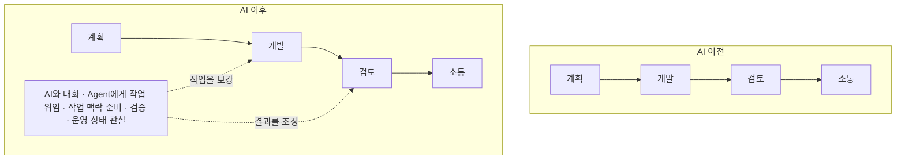

> 원문: [AI usage patterns in software teams](https://linear.app/data)

## 핵심 요약

AI 도입 뒤 일을 더 빨리 끝내는 순간이 생겨도, 조직 전체의 일이 자동으로 줄었다고 말하기는 어렵습니다. Agent에게 일을 맡기고 작업 맥락을 준비하며, 결과를 검증·통합·운영하는 활동이 기존 업무 위에 추가될 수 있기 때문입니다.

이 글은 AI 생산성을 절감 시간 하나로 환산하는 대신, 처리량, 업무량, 사람과 Agent 간 조정 비용을 함께 읽는 기준을 제안합니다. Linear 자료는 이 변화를 관찰한 첫 사례이지, 모든 조직의 결과를 증명하는 결론은 아닙니다.

## 절감 시간만으로는 업무 구조의 변화를 설명하기 어렵습니다

AI를 도입할 때 “얼마나 시간이 절약됐는가?”는 유용한 질문입니다. 초안 작성, 검색, 반복 구현처럼 특정 작업의 시간이 실제로 줄 수 있습니다. 그러나 그 질문만으로는 목표 설정, 작업 맥락 준비, 예외 처리, 결과 검증, 배포 뒤 관찰에 새로 들어간 시간을 놓치기 쉽습니다.

| 지표 | 묻는 질문 | 함께 봐야 할 것 |
| --- | --- | --- |
| 절감 시간 | 한 작업을 더 빨리 끝냈는가? | 검증·통합까지 포함한 전체 작업 시간 |
| 처리량 | 같은 기간에 가치 있는 결과를 더 많이 냈는가? | 재작업, 품질, 검토 대기 시간 |
| 업무량 | 사람이 수행한 전체 활동은 어떻게 바뀌었는가? | 기존 업무 위에 추가된 AI 관련 활동 |
| 조정 비용 | 사람과 Agent가 같은 목표로 일하게 하는 비용은 얼마인가? | 위임, 인계, 방향 수정, 운영 상태 관찰 |

그러므로 “AI가 일을 대체한다”와 “AI를 쓰기 위해 새 일이 생긴다”는 동시에 참일 수 있습니다. 어느 쪽이 더 큰지는 업무 종류, 권한, 품질 기준, 자동화 수준에 따라 다릅니다.

## 기존 흐름 위에 새로운 업무가 더해질 수 있습니다

제품 개발에는 AI 이전에도 계획, 개발, 검토, 소통이 있었습니다. AI가 들어온 뒤 이 단계가 즉시 사라지기보다, 기존 흐름 위에 새로운 조정 활동이 반복적으로 나타날 수 있습니다.

여기서 말하는 **새로운 업무 층위**는 새로운 직무나 조직도를 뜻하지 않습니다. 이전에는 없었거나 작았지만, 이제는 여러 업무 흐름에서 반복되는 활동 묶음을 말합니다.

- **AI와 대화**: 초안·대안·조사를 받아 현재 판단에 맞게 다듬습니다.
- **Agent에게 작업 위임**: 목표, 허용 범위, 완료 조건, 금지된 행동을 정하고 작업을 맡깁니다.
- **작업 맥락 준비**: 필요한 문서·결정·입력을 찾을 수 있게 만듭니다.
- **검증**: 생성물이 사실, 정책, 테스트, 사용자 기대와 맞는지 확인합니다.
- **운영 상태 관찰**: 실패, 지연, 비용, 재시도, 품질 변화에 따라 운영 방식을 조정합니다.

이 중 일부는 시간이 지나며 도구와 프로세스에 흡수될 수 있습니다. 반대로 Agent의 역할이 넓어질수록 검증과 운영 상태 관찰의 비중이 커질 수도 있습니다. 중요한 점은 도구 사용량이 아니라, 이 추가 활동이 실제 가치와 연결되는지 관찰하는 일입니다.

## Linear은 무엇을 관찰했고 무엇은 관찰하지 못했는가

Linear은 자사 제품 안의 유료 워크스페이스 활동을 바탕으로 자료를 만들었으며, Linear 밖에서 이루어진 AI 사용은 보지 못한다고 명시합니다.[^linear-scope] 이 한계는 중요합니다. 이 자료는 시장 전체의 대표 표본이나 AI 도입의 인과 효과를 보여 주는 실험이 아닙니다.

그럼에도 하나의 제품 안에서 기존 활동과 새 AI 활동을 같은 측정 체계로 볼 수 있다는 점은 유용합니다. Linear은 AI와 대화하고 issue를 Agent에게 위임하는 활동이 전년도에는 없던 범주로 나타났고, 다른 활동이 줄어든 흔적 없이 기존 작업 위에 추가된 것처럼 보인다고 해석합니다.[^linear-work-layer]

여기서 얻을 수 있는 결론은 제한적입니다. **이 관찰은 AI가 기존 업무를 단순히 대체하지 않을 수 있음을 보여 주는 한 사례**입니다. 모든 조직의 업무량이 늘어난다거나 AI가 가치를 만들지 못한다는 결론은 아닙니다. 제품 밖의 업무, 팀마다 다른 도입 시점, 품질과 사용자 결과의 차이는 이 자료만으로 설명할 수 없습니다.

## 처리량과 업무량을 분리해 읽습니다

완료된 issue나 pull request가 늘었다면 좋은 결과일 수 있습니다. 그러나 처리량이 늘었다는 사실만으로 사람이 덜 일했다고 볼 수는 없습니다. Agent가 더 많은 초안과 변경을 만들면 팀은 더 많은 우선순위 조정, 검토, 예외 처리를 수행할 수도 있습니다.

| 관찰 | 함께 확인할 질문 |
| --- | --- |
| 완료한 결과가 늘었습니다. | 재작업, 장애, 검토 대기 시간도 함께 변했는가? |
| 초안 작성이 빨라졌습니다. | 작업 맥락 준비와 검증까지 포함한 시간은 줄었는가? |
| AI 사용량이 늘었습니다. | 품질·사용자 결과·비용도 개선됐는가? |
| Agent 실행이 많아졌습니다. | 사람이 승인·방향 수정·예외 처리하는 시간은 어떻게 바뀌었는가? |

사람과 Agent 간 조정 비용은 Agent가 실패할 때만 생기지 않습니다. 잘 동작하는 Agent도 목표, 작업 맥락, 권한, 멈춤 조건을 맞춰야 합니다. 이 비용을 사람의 확인을 없애서 줄이기보다, 반복되는 위임과 인계를 작업 구조로 만드는 방법은 [Harness Engineering](/ai/harness-engineering/)에서 다룹니다.

[^linear-scope]: [Linear, "AI usage patterns in software teams" — 관찰 범위와 방법론](https://linear.app/data)
[^linear-work-layer]: [Linear, "AI usage patterns in software teams" — AI chat과 Agent issue 활동](https://linear.app/data)
