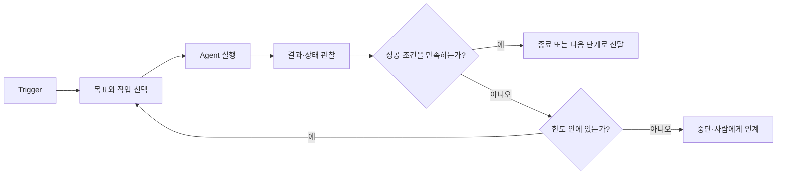

## 핵심 요약

Loop Engineering은 Agent에게 더 긴 Prompt를 쓰는 일이 아닙니다. 반복 업무가 **언제 시작하고**, 어떤 근거를 바탕으로 실행되며, 결과를 어떻게 확인하고, 언제 다시 시도하거나 멈출지를 설계하는 일입니다.

핵심은 Agent가 “완료했습니다”라고 말하는 순간을 믿는 데 있지 않습니다. 사람이 정한 목표와 검증 가능한 기준, 비용과 시간의 한도, 다음 실행으로 넘길 상태를 갖추어야 반복 작업을 통제 가능한 업무 흐름으로 만들 수 있습니다.

## Loop Engineering이 다루는 문제

AI를 잘 활용하려면 좋은 질문을 만드는 것만으로는 충분하지 않은 순간이 있습니다. 매일 아침 새 데이터를 확인해 보고서를 만들거나, 새 Issue가 등록되면 관련 코드를 조사하거나, 테스트 실패를 발견하면 원인을 좁혀 수정 후보를 정리하는 일처럼 같은 종류의 작업이 계속 돌아오는 경우입니다.

이런 업무를 대화창에서 처리하면 사람이 매번 시작 신호를 보내고, 필요한 맥락을 다시 알려 주고, 결과를 확인한 뒤 다음 행동을 지시하게 됩니다. 한 번의 결과는 좋아질 수 있지만, 업무 흐름 자체는 사람에게 묶여 있습니다.

Loop Engineering은 이 반복을 바깥에서 설계합니다. Prompt, Context, Harness, Loop는 서로 대체하는 유행어가 아니라 서로 다른 책임을 가집니다.

| 층위 | 주로 다루는 것 | 대표 질문 |
| --- | --- | --- |
| Prompt | 한 번의 요청 | 무엇을 해 달라고 말할 것인가? |
| Context | 판단에 필요한 배경 | 어떤 문서·규칙·제약을 알아야 하는가? |
| Harness | 한 번의 Agent 실행 환경 | 어떤 도구·권한·검증을 제공할 것인가? |
| Loop | 반복 실행의 제어 | 언제 시작하고, 무엇을 성공으로 보며, 언제 멈출 것인가? |

Harness가 Agent의 책상, 노트, 온보딩 자료, 사용할 수 있는 도구를 갖춘 **일자리**라면, Loop는 그 자리를 언제 열고 어떤 일을 맡기며 결과를 어떻게 처리할지를 정하는 운영 규칙입니다.

## 요청 중심 작업과 반복 제어의 차이

이 차이는 **선풍기와 에어컨**을 생각하면 이해하기 쉽습니다. 선풍기는 더우면 사람이 켜고, 추우면 사람이 끕니다. 사람이 계속 상태를 확인하고 조작해야 합니다. 한 번의 Prompt에 응답하는 Agent 작업도 대체로 이와 같습니다. 사람이 요청하고, 결과를 보고, 다음 Prompt를 보냅니다.

에어컨은 목표 온도를 설정하면 온도를 측정하고, 목표보다 높을 때만 작동하며, 목표에 도달하면 멈춥니다. 온도가 다시 올라가면 같은 규칙에 따라 재시작합니다. Loop는 이처럼 목표, 행동, 관찰, 판정을 연결한 제어 흐름입니다.

여기서 가장 중요한 차이는 **온도계**입니다. 에어컨에는 온도계가 이미 달려 있지만, AI 업무에는 무엇을 “됐다”고 볼지 자동으로 알려 주는 장치가 없습니다. 성공 기준을 정의하지 않으면 Agent는 잘못된 방향으로 계속 시도하거나, 그럴듯한 결과를 내고도 멈추지 못할 수 있습니다.

## Inner Loop와 Outer Loop

Agent는 한 세션 안에서 이미 작은 순환을 수행합니다. 현재 상태를 생각하고, 도구를 호출하고, 결과를 읽고, 다음 행동을 다시 결정합니다. 이처럼 한 번의 실행 안에서 일어나는 추론과 도구 사용의 반복을 Inner Loop라고 볼 수 있습니다.

Loop Engineering에서 사람이 설계하는 것은 대개 Outer Loop입니다. Outer Loop는 Inner Loop를 언제 시작할지, 어떤 작업을 줄지, 결과를 누가 어떤 근거로 판정할지, 다시 실행할지, 사람에게 넘길지, 완전히 멈출지를 결정합니다.

**신입사원의 첫날과 6개월 차** 비유가 이 차이를 잘 보여 줍니다. 입사 첫날에는 “이 파일을 열어 보세요. 이 형식으로 작성하세요. 숫자가 맞지 않으면 재무팀에 확인하세요”처럼 하나씩 설명해야 합니다. 시간이 지나면 “매주 금요일까지 주간 보고서를 올리고, 숫자가 맞지 않으면 재무팀에 확인하며, 판단이 애매하면 저에게 물어보세요”라고 업무를 위임할 수 있습니다.

AI는 세션이 끝나면 그 6개월의 경험을 자연스럽게 축적하지 않습니다. 그래서 반복 업무를 맡기려면 매뉴얼, 현재 진행 상태, 검증 기준, 인계 규칙을 바깥에 남겨 두어야 합니다. Agent를 더 오래 실행하는 것보다, 매 실행이 같은 운영 체계 안에서 시작하도록 만드는 편이 중요합니다.

## Outer Loop를 구성하는 다섯 가지 부품과 상태 파일

### 1. 자동화: 시작 신호를 정합니다

아무리 좋은 매뉴얼을 준 직원도 출근하지 않으면 일을 시작할 수 없습니다. Loop에서도 마찬가지로 **출근 시간표**가 필요합니다. 매일 오전 9시, 새 파일 업로드, CI 실패, Issue 등록, 특정 지표의 임계값 초과처럼 실행을 시작하는 Trigger를 정합니다.

Trigger가 없다면 Agent에게 한 번 일을 시킨 것일 뿐, 반복되는 Loop는 아닙니다. 반대로 Trigger만 정하고 작업의 범위·검증·종료를 비워 두면, 매번 자동으로 불확실한 일을 시작하는 시스템이 됩니다. 자동화는 출발점이지, 자율성의 전부가 아닙니다.

### 2. 작업 공간 분리: 병렬 실행의 충돌을 막습니다

여러 Agent가 같은 파일을 동시에 수정하면 결과가 섞입니다. 이는 **같은 기획서를 두 사람이 각자 열어 수정하고, 어느 파일이 최종본인지 알 수 없게 되는 상황**과 같습니다.

병렬 작업이 필요하다면 Agent마다 독립된 작업 공간을 주고, 결과를 검토한 뒤에만 합쳐야 합니다. Git의 linked worktree는 한 저장소에서 여러 작업 트리를 별도로 checkout할 수 있게 하며, 각 worktree는 `HEAD`, index 같은 작업별 상태를 분리합니다.[^git-worktree] 작업 공간을 분리한다고 자동으로 안전해지는 것은 아니지만, 적어도 서로의 미완성 변경을 덮어쓰는 문제를 구조적으로 줄일 수 있습니다.

### 3. Skills: 반복 가능한 업무 지식을 파일로 옮깁니다

Skills는 Agent에게 매번 긴 Prompt를 보내는 대신, 입력, 확인 순서, 산출물, 중단 조건을 재사용 가능한 절차로 남기는 방식입니다. **사람의 머릿속 노하우를 업무 매뉴얼로 옮기는 일**에 가깝습니다.

예를 들어 “배포 실패를 조사할 때는 먼저 이 로그를 확인하고, 고객 데이터는 출력하지 말며, 결과에는 재현 조건과 다음 확인 항목을 남긴다”는 절차를 Skill로 정리할 수 있습니다. Agent Skills는 필요한 순간에만 상세 내용을 불러올 수 있으므로, 모든 규칙을 매 요청의 Context에 넣지 않아도 됩니다.[^anthropic-skills]

매뉴얼이 없으면 Agent는 Loop가 돌 때마다 회사의 방식과 결과 형식을 다시 추측합니다. 매뉴얼이 있으면 같은 기준에서 시작할 수 있습니다. 다만 오래된 매뉴얼은 잘못된 답을 더 일관되게 만들 수 있으므로, 실제 업무가 바뀌면 함께 갱신해야 합니다.

### 4. MCP: 읽을 권한과 실행할 능력을 구분합니다

Agent가 파일을 읽을 수 있다고 해서 메일, Issue tracker, 모니터링 도구, 데이터베이스를 활용할 수 있는 것은 아닙니다. 이는 유능한 직원에게 업무를 맡겼지만 **사무실 문이 잠겨 있고 필요한 시스템 권한도 없는 상태**와 같습니다.

MCP(Model Context Protocol)는 모델이 외부 시스템의 도구를 발견하고 호출할 수 있게 하는 표준입니다.[^mcp-tools] 이를 통해 Agent는 단순히 “이렇게 하시면 됩니다”라고 답하는 대신, 권한이 허용된 범위에서 자료를 조회하거나 정해진 작업을 실행할 수 있습니다.

그러나 MCP 연결은 자동 실행 권한을 무제한으로 주는 일이 아닙니다. 어떤 도구를 노출할지, 읽기와 쓰기를 어떻게 나눌지, 되돌릴 수 없는 작업 앞에서 누구의 승인을 받을지를 함께 정해야 합니다. MCP 명세도 도구 호출을 거부할 수 있는 사람의 통제를 권고합니다.[^mcp-human-control]

### 5. Subagent: 작성자와 검토자를 분리합니다

자신이 쓴 보고서를 자신이 검토하면, 빠뜨린 가정을 발견하기 어렵습니다. **작성자와 검사자를 분리하는 일**은 사람이 하는 업무에서도 자연스러운 품질 관리 방식입니다.

Agent 작업에서도 생성 역할과 검증 역할을 분리할 수 있습니다. 생성 Agent는 구현·조사·초안을 맡고, 검증 Agent는 요구사항 누락, 금지된 변경, 테스트 결과, 출처, 불확실성을 의심하는 관점에서 확인합니다. 별도 모델을 쓴다는 사실만으로 독립성이 생기는 것은 아니며, 두 역할이 다른 입력·권한·검증 기준을 가져야 합니다.

Subagent는 대량 탐색이나 로그 분석을 별도 Context에서 처리하고, 주 작업에는 필요한 결과만 돌려주는 데에도 유용합니다. Anthropic의 문서도 Subagent가 독립된 Context와 도구 권한을 가질 수 있으며, 탐색 결과가 주 작업의 Context를 과도하게 채우는 일을 줄일 수 있다고 설명합니다.[^anthropic-subagents]

### 상태 파일: 다음 실행이 이어받을 기록을 남깁니다

매뉴얼이 회사의 방식을 기억한다면, 상태 파일은 어제까지의 진행을 기억합니다. 이는 **퇴근 전 작성하는 인수인계 노트**와 같습니다. 무엇을 시도했는지, 어떤 검증이 실패했는지, 지금 막힌 이유가 무엇인지, 다음 실행이 어디서 시작해야 하는지를 대화 밖의 파일에 기록합니다.

상태 파일에는 완성된 결과만 적지 않습니다. 이미 버린 가설, 재시도하지 말아야 할 접근, 아직 확인하지 못한 위험도 남겨야 합니다. 그래야 다음 Agent가 같은 막다른 길을 다시 탐색하지 않고, 사람도 왜 작업이 멈췄는지 이해할 수 있습니다.

## 검증 가능한 종료 조건

Loop를 처음 만들 때 흔한 실수는 종료 조건을 비워 두는 일입니다. **온도계 없는 에어컨**은 언제 멈춰야 할지 모르므로 계속 돌아갑니다. AI Loop에서 계속되는 실행은 token과 도구 호출, 대기 시간, 사람이 다시 읽어야 할 결과를 늘립니다. **멈추지 않는 에어컨의 전기요금**이 AI 업무에서는 누적 비용과 운영 부담이 되는 셈입니다.

종료 조건은 횟수 기반과 조건 기반을 함께 사용합니다.

| 종류 | 예시 | 한계 또는 역할 |
| --- | --- | --- |
| 횟수 기반 | 최대 3회 재시도 | 무한 반복을 막지만, 실제 성공을 보장하지는 않습니다. |
| 시간·비용 기반 | 15분 또는 예산 한도에서 중단 | 예상 밖의 비용과 지연을 제한합니다. |
| 조건 기반 | 테스트 통과, 필수 항목 충족, 모든 수치에 출처 연결 | 실제 결과를 판정하는 핵심 기준입니다. |
| 무진전 기반 | 두 번 연속 같은 오류·같은 결과면 중단 | 같은 실패를 반복하지 않게 합니다. |

좋은 종료 조건은 “좋은 보고서가 될 때까지”처럼 해석에 의존하지 않습니다. 대신 “필수 항목 다섯 개가 모두 채워졌고, 수치마다 출처 링크가 있으며, 형식 검증을 통과했을 때”처럼 참·거짓을 판정할 수 있어야 합니다.

검증은 하나만 두지 않는 편이 좋습니다. Agent가 검사 통과를 보고하더라도, 실제 테스트·정적 분석·정책 검사처럼 독립적으로 실행할 수 있는 근거를 남겨야 합니다. 생성 결과와 평가 피드백을 분리하는 evaluator-optimizer 방식도, 평가 기준이 명확하고 반복 개선의 가치를 측정할 수 있을 때 효과적입니다.[^anthropic-evaluator-optimizer]

또한 모든 실패를 재시도로 해결하려고 하면 안 됩니다. 권한 부족, 정책 충돌, 요구사항 모호성, 되돌릴 수 없는 외부 변경, 기준 자체의 불충분함은 사람에게 넘겨야 할 신호입니다. 사람에게 넘기는 것은 Loop의 실패가 아니라, 그 Loop가 자신의 판단 범위를 제대로 지키는 결과입니다.

## 작은 반복 업무에서 시작하기

처음부터 모든 업무를 자율적으로 처리하는 시스템을 만들 필요는 없습니다. 다음 세 조건을 만족하는 반복 업무 하나를 고르는 편이 좋습니다.

1. 시작 신호가 분명합니다. 예를 들어 매주 정해진 시각, 새 Issue, 테스트 실패처럼 실행 시점을 알 수 있습니다.
2. 결과 기준을 기계적으로 확인할 수 있습니다. 테스트 통과, 필수 필드 존재, 형식 검사처럼 측정 가능한 기준이 필요합니다.
3. 실패했을 때 사람에게 넘길 경계가 분명합니다. 자동으로 해결하지 못할 경우에도 무엇을 남기고 누구에게 전달할지 정할 수 있어야 합니다.

처음에는 Trigger 하나, 작업 공간 하나, Skill 하나, 검증 명령 하나, 상태 파일 하나로 충분합니다. 이 작은 Loop를 실제로 운영하면서 재시도 횟수, 실패 유형, 사람이 자주 개입하는 지점을 관찰하면 다음에 보강할 부품이 보입니다.

Loop Engineering의 목적은 Agent를 계속 돌리는 데 있지 않습니다. 사람이 반복해서 하던 시작, 확인, 기록, 재지시의 일부를 명시적인 규칙으로 옮기고, 그 규칙이 안전하게 멈출 수 있게 만드는 데 있습니다. 목표와 경계, 검증과 인계를 설계할 수 있다면 Agent는 한 번의 대화 도구를 넘어 반복 업무를 함께 처리하는 실행 단위가 될 수 있습니다.

[^git-worktree]: [Git, "git-worktree"](https://git-scm.com/docs/git-worktree)

[^anthropic-skills]: [Anthropic, "Extend Claude with skills"](https://code.claude.com/docs/en/skills)

[^mcp-tools]: [Model Context Protocol, "Tools"](https://modelcontextprotocol.io/specification/draft/server/tools)

[^mcp-human-control]: [Model Context Protocol, "Tools — User Interaction Model"](https://modelcontextprotocol.io/specification/draft/server/tools#user-interaction-model)

[^anthropic-subagents]: [Anthropic, "Create custom subagents"](https://code.claude.com/docs/en/sub-agents)

[^anthropic-evaluator-optimizer]: [Anthropic, "Building Effective AI Agents"](https://www.anthropic.com/engineering/building-effective-agents)
