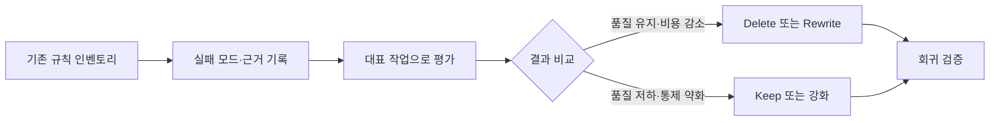

> 원문: [Everyone Benchmarked Opus 5. Nobody Read the Deletion List That Shipped With It](https://medium.com/ai-all-in/everyone-benchmarked-opus-5-nobody-read-the-deletion-list-that-shipped-with-it-daa43800d4eb)

## 핵심 요약

모델 교체는 model ID만 바꾸는 일이 아니라, 이전 모델의 한계를 보완하려고 쌓인 하네스 규칙을 다시 평가하는 일입니다. 모델 내부의 중복 self-check나 과도한 지시는 evaluation으로 줄일 수 있지만, 테스트·권한·승인처럼 시스템이 보장해야 하는 독립 통제는 유지해야 합니다.

새 모델이 출시되면 벤치마크 점수, 가격, context window부터 비교하기 쉽습니다. 하지만 실제 Agent 환경에서는 모델 교체 뒤에도 프롬프트, hook, 평가 규칙, 권한 정책이 그대로 남습니다. 이 규칙 중 일부는 이전 모델의 약점을 보완하려고 만들었을 수 있습니다.

그래서 모델 교체는 model ID를 바꾸는 작업이 아니라 **하네스 규칙을 다시 검증하는 작업**으로 보는 편이 안전합니다. 이 글에서는 어떤 지침을 줄일 수 있는지와 절대 모델의 능력 향상만으로 없애면 안 되는 통제를 구분하는 절차를 정리합니다.

## 먼저 구분할 것: 모델에게 시키는 확인과 시스템이 보장하는 확인

모델용 지침에는 종종 다음과 같은 문장이 들어갑니다.

```text
중요한 작업이 끝나면 반드시 결과를 다시 확인하세요.
별도의 검토 단계를 거친 뒤에만 답변하세요.
```

이런 지침은 이전 모델이 너무 빨리 결론을 내리거나, 도구 실행 결과를 읽지 않고 다음 단계로 넘어가는 문제를 줄이기 위해 유용했을 수 있습니다. 하지만 새 모델이 같은 확인을 기본 행동으로 수행한다면, 지침은 확인을 한 번 더 반복하게 하거나 불필요한 narration과 token 사용을 늘릴 수 있습니다.

Anthropic의 Opus 5 프롬프트 가이드도 이 점을 구체적으로 설명합니다. 모델이 스스로 수행하는 재확인을 다시 지시하면 비용은 늘고 품질 이득은 없을 수 있으며, 기존 effort 설정도 자체 evaluation으로 다시 살피라고 권합니다.[^opus5-prompting]

그렇다고 "검증을 삭제한다"고 결론 내리면 안 됩니다. 아래 두 층은 책임 주체가 다릅니다.

| 구분 | 예시 | 모델 변경 뒤의 처리 |
| --- | --- | --- |
| **모델 내부의 작업 습관** | 중복 self-check, 지나친 진행 상황 설명, 필요 이상의 subagent delegation | 새 모델에서 실제로 중복되는지 평가한 뒤 keep·rewrite·delete를 결정합니다. |
| **시스템의 독립 통제** | 테스트, 정적 분석, 권한 검사, 비밀값 차단, 배포 승인, audit log | 모델의 능력과 별개로 유지합니다. 필요하면 테스트 대상과 정책을 갱신합니다. |

테스트가 통과했는지, write 권한이 있는지, 민감한 작업에 사람이 승인했는지는 모델이 잘 추론한다고 해서 자동으로 보장되지 않습니다. 특히 외부 부작용이 있는 도구에서는 모델의 self-correction과 독립 검증을 같은 것으로 취급하지 않아야 합니다.

## 규칙을 줄이기 전에 실패 모드를 기록합니다

하네스 파일은 시간이 갈수록 "안전한 문장"이 누적되기 쉽습니다. 문장 하나를 지우거나 유지하기 전에 그 문장이 막으려던 실패를 한 줄로 적어 두면 판단이 훨씬 명확해집니다.

| 규칙 | 원래 막으려던 실패 | 확인할 관찰값 |
| --- | --- | --- |
| "모든 답변을 두 번 검토" | 성급한 결론, 누락 | 실제 오류율, 실행 시간, token 사용량 |
| "작업마다 subagent를 사용" | 한 모델의 관점 편향 | 독립 작업의 병렬성, subagent 간 충돌, 비용 |
| "매 도구 호출을 길게 설명" | 사용자가 진행 상황을 알 수 없음 | 사용자가 필요한 시점의 상태 갱신 여부, 응답 길이 |
| "테스트가 끝나면 배포" | 수동 확인 누락 | 테스트 범위, 권한·보안 검사, 승인 기록 |

여기서 마지막 규칙은 보통 **삭제 후보가 아닙니다**. 테스트만으로 배포가 허용되는지 결정하는 것은 모델의 품질 문제가 아니라 배포 정책 문제이기 때문입니다. 반대로 "모든 답변을 두 번 검토"는 새 모델이 기본적으로 수행하는 행동과 겹칠 가능성이 있으므로, 평가 후보가 될 수 있습니다.

## keep, rewrite, delete는 evaluation으로 결정합니다

규칙 감사는 긴 토론보다 작은 evaluation으로 시작하는 편이 낫습니다. LLM application의 성공 기준은 구체적이고 측정 가능해야 하며, 실제 작업 분포를 반영한 평가 세트로 확인해야 합니다.[^anthropic-evals]

다음 흐름으로 진행할 수 있습니다.



예를 들어 세 가지 대표 작업을 고를 수 있습니다.

1. 여러 파일을 바꾸는 기능 수정
2. 좁은 범위의 bug fix
3. 도구 호출과 사용자 승인이 섞인 운영 작업

각 작업에서 기존 하네스와 후보 규칙을 제거하거나 짧게 바꾼 하네스를 비교합니다. 단순히 "답변이 좋아 보인다"가 아니라, task completion, 테스트 통과 여부, 승인 없는 side effect, 지연 시간, token 비용을 함께 기록해야 합니다. 모델 제공자도 migration 때 API 변경뿐 아니라 비용과 workload별 동작을 다시 기준선으로 잡으라고 안내합니다.[^claude-migration]

평가 결과는 다음처럼 판단합니다.

- **Keep**: 규칙을 제거했을 때 오류, 승인 누락, 비용 또는 사용자 경험이 악화됩니다.
- **Rewrite**: 목적은 남아 있지만, 더 짧고 측정 가능한 지시로 바꿀 수 있습니다. 예를 들어 "계속 자세히 설명" 대신 "중요한 발견이나 방향 변경 때만 한 문장으로 알림"처럼 바꿉니다.
- **Delete**: 새 모델의 기본 행동과 완전히 겹치고, 제거 뒤에도 성공 기준이 유지됩니다.

이 결정은 모델 버전, 평가 입력, 실행 날짜와 함께 남겨야 합니다. 그래야 다음 모델 이행 때 "왜 이 규칙이 존재하는가"를 처음부터 추측하지 않아도 됩니다.

## 모델의 장점을 정책 삭제의 근거로 쓰지 않습니다

새 모델은 더 적은 effort에서 같은 품질을 내거나, 긴 작업에서 더 안정적으로 행동할 수 있습니다. 그러나 제품 문서의 성능 설명이나 벤치마크 결과는 특정 harness와 평가 조건에서 나온 결과입니다. 해당 수치만으로 자신의 데이터, 도구, 권한 모델에서도 안전하다고 일반화할 수는 없습니다.[^opus5-announcement]

특히 다음 항목은 모델을 교체해도 독립적으로 확인해야 합니다.

- **권한 경계**: read-only 도구와 외부 쓰기 도구의 권한은 코드와 정책이 강제해야 합니다.
- **검증 실행**: compiler, unit test, integration test, 정적 분석처럼 재현 가능한 verifier는 계속 실행해야 합니다.
- **승인 지점**: 비용이 크거나 되돌리기 어려운 작업은 사람 또는 별도 정책 엔진의 승인을 거쳐야 합니다.
- **관찰 가능성**: 어떤 모델·프롬프트·도구 조합이 어떤 결과를 냈는지 trace와 평가 결과를 남겨야 합니다.

따라서 좋은 하네스는 "모델을 믿지 않기 위한 장치"만은 아닙니다. 모델별로 불필요해진 습관은 줄이면서도, 제품이 독립적으로 책임져야 할 경계는 명확하게 남기는 장치입니다.

## 모델 이행은 규칙을 비우는 일이 아니라 근거를 갱신하는 일입니다

하네스 지침을 계속 늘리면 모델은 의도를 파악하기보다 규칙을 해석하는 데 많은 비용을 쓸 수 있습니다. 반대로 모든 검증 지시를 지우면 실패가 모델 밖의 시스템으로 번질 수 있습니다.

가장 실용적인 기준은 간단합니다. 각 규칙에 원래의 실패 모드와 성공 기준을 연결하고, 새 모델에서 작은 평가로 다시 확인합니다. 중복된 모델 내부 습관은 줄이고, 테스트·권한·승인·관찰성처럼 독립적인 통제는 유지합니다. 이렇게 남긴 기록이 다음 모델 이행의 가장 신뢰할 수 있는 migration guide가 됩니다.

[^opus5-prompting]: [Anthropic: Prompting Claude Opus 5](https://platform.claude.com/docs/en/build-with-claude/prompt-engineering/prompting-claude-opus-5)
[^anthropic-evals]: [Anthropic: Define success criteria and build evaluations](https://platform.claude.com/docs/en/test-and-evaluate/develop-tests)
[^claude-migration]: [Anthropic: Migration guide](https://platform.claude.com/docs/en/about-claude/models/migration-guide)
[^opus5-announcement]: [Anthropic: Introducing Claude Opus 5](https://www.anthropic.com/news/claude-opus-5)
