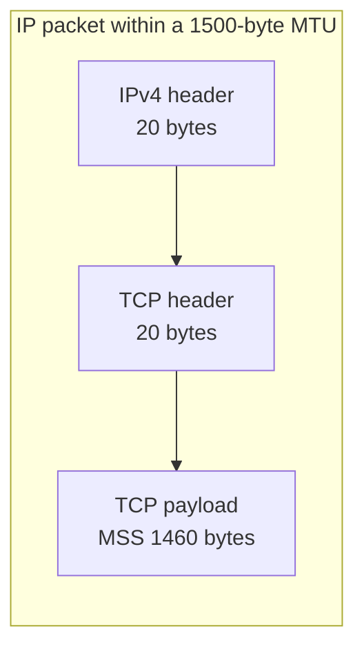

네트워크를 통과하는 데이터는 링크가 받아들일 수 있는 크기로 나뉩니다. 이때 링크 계층에서 한 번에 실을 수 있는 최대 IP 패킷 크기가 **MTU**(Maximum Transmission Unit)이고, TCP가 한 세그먼트에 담는 애플리케이션 데이터의 최대 크기가 **MSS**(Maximum Segment Size)입니다.

## MTU란?

MTU는 네트워크 인터페이스가 전달할 수 있는 최대 패킷 크기입니다. 일반적인 이더넷의 IP MTU는 1500바이트이며, PPPoE 환경에서는 흔히 1492바이트가 쓰입니다.

경로 중간의 장비가 더 작은 MTU만 허용하면 큰 패킷은 문제가 될 수 있습니다.

- IPv4에서는 단편화가 허용된 경우 패킷이 여러 조각으로 나뉠 수 있습니다.
- IPv6 라우터는 중간에서 단편화하지 않으므로, 송신 측이 경로 MTU에 맞춰야 합니다.
- 단편화가 금지된 큰 패킷은 폐기되고, 적절한 ICMP 메시지가 돌아오지 않으면 연결이 멈춘 것처럼 보일 수 있습니다.

## MSS란?

MSS는 TCP 세그먼트 안에서 애플리케이션 데이터가 차지할 수 있는 최대 크기입니다. TCP 연결을 만들 때 각 측이 자신의 수신 MSS를 알리고, 실제 전송 크기는 상대방의 값과 경로 조건에 맞춰 정해집니다.

IPv4 헤더와 TCP 헤더가 각각 옵션 없이 20바이트라면, MTU가 1500바이트인 이더넷에서 흔히 보는 MSS는 다음과 같습니다.

```text
MSS = MTU - IPv4 header - TCP header
    = 1500 - 20 - 20
    = 1460 bytes
```

헤더에 옵션이 있거나 IPv6를 쓰면 헤더 크기가 달라지므로, `1460`은 모든 환경에 적용되는 상수가 아닙니다.

## MTU와 MSS의 관계



MSS는 TCP 데이터 구간만 가리키고, MTU는 IP 패킷 전체를 가리킨다는 점이 핵심입니다. TCP가 MSS를 경로에 맞게 줄이면, IP 계층에서의 단편화를 피하는 데 도움이 됩니다.

## 설정이 맞지 않을 때의 증상

잘못된 MTU 설정은 대용량 응답만 느리거나, VPN·터널을 통과할 때 특정 서비스만 멈추는 현상으로 나타날 수 있습니다. 이는 터널 헤더가 추가되어 실제로 전달 가능한 IP 패킷 크기가 줄어들기 때문입니다.

운영체제에서 인터페이스 MTU를 확인할 때는 다음처럼 볼 수 있습니다.

```bash
ip link show
```

문제를 재현할 때는 대상 경로와 터널·VPN 유무를 함께 확인하고, 임의의 고정값을 적용하기 전에 경로 MTU와 TCP MSS 협상 결과를 관찰하는 편이 안전합니다.

## 정리

| 용어          | 의미                                               |
| ------------- | -------------------------------------------------- |
| MTU           | 링크가 전달할 수 있는 최대 IP 패킷 크기            |
| MSS           | TCP 세그먼트의 최대 애플리케이션 데이터 크기       |
| Fragmentation | 큰 IPv4 패킷을 여러 조각으로 나누는 과정           |
| Path MTU      | 송신지와 수신지 사이 경로가 허용하는 가장 작은 MTU |

적절한 MTU와 MSS는 단편화와 불필요한 재전송을 줄여 전송 효율과 연결 안정성에 도움을 줍니다.

## 참고

- [Cloudflare: MTU란 무엇인가?](https://www.cloudflare.com/ko-kr/learning/network-layer/what-is-mtu/)
- [Cloudflare: MSS란 무엇인가?](https://www.cloudflare.com/ko-kr/learning/network-layer/what-is-mss/)
- [Cisco: Ethernet MTU and TCP MSS Adjustment](https://www.cisco.com/c/ko_kr/support/docs/ip/transmission-control-protocol-tcp/200932-Ethernet-MTU-and-TCP-MSS-Adjustment-Conc.html)
