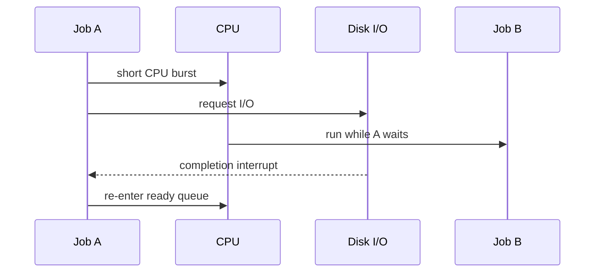

> 학습 자료: [OSTEP 7장 CPU Scheduling](https://pages.cs.wisc.edu/~remzi/OSTEP/Korean/07-cpu-sched.pdf)

CPU 스케줄링은 준비된 작업 중 무엇을 언제 실행할지 정하는 정책입니다. 제한적 직접 실행으로 운영체제가 CPU 제어권을 되찾을 수 있다면, 그다음 질문은 어떤 작업에 CPU를 먼저 줄 것인가입니다.

## 핵심 질문

| 질문                      | 핵심 답변                                                                                  |
| ------------------------- | ------------------------------------------------------------------------------------------ |
| 정책은 어떻게 설계하는가? | 워크로드 가정과 평가 지표를 먼저 정하고, 가정을 하나씩 완화합니다.                         |
| 어떤 지표가 중요한가?     | 일괄 처리에는 반환 시간, 대화형 시스템에는 응답 시간, 시스템 전체에는 공정성이 중요합니다. |
| FIFO의 한계는?            | 긴 작업이 먼저 도착하면 짧은 작업들이 함께 기다리는 convoy effect가 생깁니다.              |
| SJF의 장점은?             | 모든 작업이 동시에 도착하고 실행 시간을 안다면 평균 반환 시간을 최소화합니다.              |
| STCF는 무엇을 더하는가?   | 새 작업이 오면 남은 실행 시간이 가장 짧은 작업을 선택하는 선점입니다.                      |
| RR의 목표는?              | 작업을 타임 슬라이스로 번갈아 실행해 첫 응답 시간을 줄입니다.                              |

## 워크로드 가정과 평가 기준

처음에는 단순한 모델로 시작합니다. 모든 작업이 동시에 도착하고, 실행 시간은 알려져 있으며, 시작한 작업은 끝날 때까지 CPU만 쓴다고 가정합니다. 현실에서는 작업 길이와 도착 시점이 다르고, 타이머 인터럽트로 선점할 수 있으며, I/O 대기도 있습니다.

| 지표      | 식                         | 의미                                           |
| --------- | -------------------------- | ---------------------------------------------- |
| 반환 시간 | `T_completion - T_arrival` | 작업 도착부터 완료까지 걸린 시간               |
| 응답 시간 | `T_first_run - T_arrival`  | 작업 도착부터 처음 CPU를 얻을 때까지 걸린 시간 |
| 공정성    | 정책마다 정의              | CPU를 작업 사이에 얼마나 균등하게 나누는지     |

반환 시간과 응답 시간은 충돌할 수 있습니다. 짧은 작업을 먼저 끝내면 평균 반환 시간은 좋아지지만, 뒤에 있는 작업의 첫 응답은 늦어질 수 있습니다.

## FIFO와 convoy effect

FIFO(First In, First Out)는 도착 순서대로 작업을 실행합니다. 구현은 단순하지만 긴 작업이 먼저 오면 뒤의 짧은 작업이 모두 밀립니다.


_그림 10.2. FIFO에서 긴 작업이 짧은 작업을 기다리게 만드는 convoy effect. 출처: [OSTEP 7장 CPU Scheduling](https://pages.cs.wisc.edu/~remzi/OSTEP/Korean/07-cpu-sched.pdf)_

| 작업 | 도착 | 실행 시간 | 완료 | 반환 시간 |
| ---- | ---: | --------: | ---: | --------: |
| A    |    0 |       100 |  100 |       100 |
| B    |    0 |        10 |  110 |       110 |
| C    |    0 |        10 |  120 |       120 |
| 평균 |      |           |      |       110 |

긴 A가 짧은 B, C를 끌고 가는 현상을 **convoy effect**라고 합니다.

## SJF와 STCF

SJF(Shortest Job First)는 실행 시간이 짧은 작업을 먼저 실행합니다. 모든 작업이 동시에 도착하고 실행 시간을 알고 있다면 평균 반환 시간에 최적입니다.

| 작업 | 도착 | 실행 시간 | 완료 | 반환 시간 |
| ---- | ---: | --------: | ---: | --------: |
| B    |    0 |        10 |   10 |        10 |
| C    |    0 |        10 |   20 |        20 |
| A    |    0 |       100 |  120 |       120 |
| 평균 |      |           |      |        50 |

하지만 SJF는 비선점 정책입니다. A가 이미 시작한 뒤 B와 C가 도착해도 A를 멈출 수 없습니다.

STCF(Shortest Time-to-Completion First), 또는 PSJF는 이를 선점으로 보완합니다. 새 작업이 도착하면 현재 작업을 포함해 남은 실행 시간이 가장 짧은 작업을 선택합니다.


_그림 10.5. STCF는 짧은 작업이 도착하면 긴 작업을 선점합니다. 출처: [OSTEP 7장 CPU Scheduling](https://pages.cs.wisc.edu/~remzi/OSTEP/Korean/07-cpu-sched.pdf)_

| 작업 | 도착 | 실행 시간 | 완료 | 반환 시간 |
| ---- | ---: | --------: | ---: | --------: |
| A    |    0 |       100 |  120 |       120 |
| B    |   10 |        10 |   20 |        10 |
| C    |   10 |        10 |   30 |        20 |
| 평균 |      |           |      |        50 |

STCF는 타이머 인터럽트와 문맥 교환을 통해 긴 작업을 잠시 멈추고 짧은 작업을 먼저 끝냅니다.

## Round Robin

RR(Round Robin)은 각 작업에 같은 크기의 타임 슬라이스를 주고 다음 준비 작업으로 넘어갑니다. 목표는 완료 시점보다 **첫 응답 시간**을 줄이는 것입니다.


_그림 10.6, 10.7. SJF와 Round Robin의 응답 시간 차이. 출처: [OSTEP 7장 CPU Scheduling](https://pages.cs.wisc.edu/~remzi/OSTEP/Korean/07-cpu-sched.pdf)_

| 정책       | 장점                      | 단점                                             |
| ---------- | ------------------------- | ------------------------------------------------ |
| SJF / STCF | 평균 반환 시간에 유리     | 작업 길이를 알아야 하며 응답 시간이 나쁠 수 있음 |
| RR         | 응답 시간과 공정성에 유리 | 문맥 교환이 늘고 평균 반환 시간은 나빠질 수 있음 |

타임 슬라이스를 짧게 하면 사용자는 더 빨리 첫 반응을 보지만, 문맥 교환 비용이 커집니다. 이 비용은 레지스터 저장·복원뿐 아니라 캐시, TLB, 분기 예측 상태에도 영향을 줍니다.

## I/O와 CPU의 중첩

I/O를 요청한 작업은 CPU를 쓰지 못하므로, 스케줄러는 그 시간에 다른 작업을 실행해야 합니다.



CPU burst가 짧은 I/O 중심 작업을 적절히 다시 실행하면 CPU와 I/O를 겹쳐 전체 자원 이용률을 높일 수 있습니다.

## 간단한 시뮬레이터

정책별 차이는 OSTEP의 스케줄러 시뮬레이터로 확인할 수 있습니다.

```bash
python3 code/ostep/cpu-scheduling/scheduler.py --policy fifo --jobs A:0:100,B:0:10,C:0:10
python3 code/ostep/cpu-scheduling/scheduler.py --policy sjf --jobs A:0:100,B:0:10,C:0:10
python3 code/ostep/cpu-scheduling/scheduler.py --policy stcf --jobs A:0:100,B:10:10,C:10:10
python3 code/ostep/cpu-scheduling/scheduler.py --policy rr --quantum 1 --jobs A:0:5,B:0:5,C:0:5
```

## 정리

- FIFO는 단순하지만 convoy effect에 취약합니다.
- SJF는 이상적인 가정 아래 평균 반환 시간에 유리합니다.
- STCF는 선점으로 늦게 도착한 짧은 작업도 빠르게 처리합니다.
- RR은 응답 시간과 공정성을 개선하지만 문맥 교환 비용을 감수합니다.
- 실제 운영체제는 작업의 미래 실행 시간을 알 수 없으므로, 이후 장의 MLFQ처럼 과거 행동을 바탕으로 우선순위를 추정합니다.
