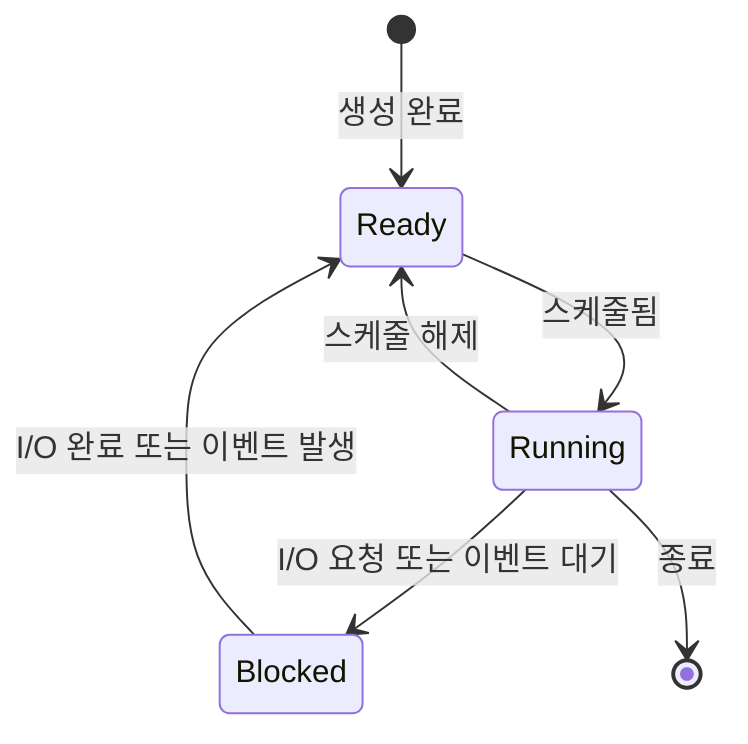

운영체제를 공부할 때 가장 먼저 잡아야 하는 개념 중 하나가 **프로세스(Process)** 입니다. 프로세스는 단순히 디스크에 저장된 프로그램 파일이 아니라, 운영체제가 메모리에 올리고 실행 상태를 부여한 **실행 중인 프로그램**입니다.

> 학습 자료: [OSTEP 4장 Processes](https://pages.cs.wisc.edu/~remzi/OSTEP/Korean/04-cpu-intro.pdf)

## 한 문장 요약

프로세스는 실행 중인 프로그램이며, 운영체제는 시분할과 문맥 교환을 사용해 적은 수의 CPU로도 많은 프로세스가 각자 CPU를 가진 것처럼 보이게 만듭니다.

## 핵심 질문

| 질문 | 핵심 답변 |
| --- | --- |
| CPU가 여러 개 존재한다는 환상을 어떻게 제공하는가? | 운영체제는 CPU를 짧은 시간 단위로 여러 프로세스에 번갈아 배정합니다. |
| 프로세스란 무엇인가? | 디스크의 프로그램 파일에 메모리, 레지스터, 열린 파일 같은 실행 상태가 더해진 실행 중인 프로그램입니다. |
| 프로세스는 어떤 상태를 포함하는가? | 주소 공간, 레지스터, 프로그램 카운터, 스택 포인터, 열린 파일 목록처럼 실행 재개에 필요한 기계 상태를 포함합니다. |
| 프로그램은 어떻게 프로세스가 되는가? | 운영체제가 코드·데이터를 적재하고, 스택·힙·I/O 상태를 준비한 뒤 엔트리 포인트에서 실행합니다. |
| 상태 전이가 필요한 이유는? | 준비·실행·대기 상태를 구분해야 스케줄러가 CPU를 줄 프로세스를 고르고, I/O 대기 중에는 다른 프로세스를 실행할 수 있습니다. |
| 운영체제는 어떻게 관리하는가? | 프로세스 리스트와 PCB(Process Control Block)에 PID, 상태, 레지스터 문맥, 열린 파일, 부모 프로세스 등을 저장합니다. |

## 프로그램과 프로세스

| 구분 | 의미 |
| --- | --- |
| 프로그램 | 디스크에 저장된 실행 파일입니다. 코드와 정적 데이터를 담지만 그 자체로는 실행 중이 아닙니다. |
| 프로세스 | 운영체제가 프로그램을 실행 가능한 상태로 만든 것입니다. 메모리, 레지스터, 열린 파일 등 실행 문맥을 함께 가집니다. |

프로그램은 레시피에 가깝고, 프로세스는 그 레시피를 실제로 따라 조리 중인 실행 상태에 가깝습니다. 같은 프로그램 파일에서 여러 개의 프로세스가 만들어질 수 있으며, 각 프로세스는 독립적인 실행 상태를 가집니다.

## CPU 가상화

CPU 가상화의 핵심은 **한 프로세스를 잠시 실행하고, 멈춘 뒤, 다른 프로세스를 실행하는 것**입니다. 운영체제는 이 과정을 빠르게 반복해서 여러 프로세스가 동시에 실행되는 것처럼 보이게 만듭니다.

| 개념 | 설명 |
| --- | --- |
| 시분할 | CPU 시간을 여러 프로세스가 번갈아 사용하게 하는 방식 |
| 문맥 교환 | 실행 중인 프로세스의 상태를 저장하고 다른 프로세스의 상태를 복원하는 기법 |
| 메커니즘 | 문맥 교환처럼 어떤 기능을 가능하게 하는 저수준 구현 방법 |
| 정책 | 여러 선택지 중 무엇을 고를지 결정하는 알고리즘 |
| 스케줄링 정책 | 준비 상태의 프로세스 중 어떤 프로세스를 실행할지 결정하는 정책 |

메커니즘은 “어떻게 가능한가”에 답하고, 정책은 “무엇을 선택할 것인가”에 답합니다. CPU 가상화에서 문맥 교환은 메커니즘이고, 다음에 실행할 프로세스를 고르는 스케줄러는 정책입니다.

## 프로세스의 기계 상태

운영체제가 프로세스를 멈췄다가 다시 실행하려면, 나중에 이어서 실행할 수 있는 정보를 저장해야 합니다.

| 상태 | 의미 |
| --- | --- |
| 주소 공간 | 프로세스가 접근할 수 있는 코드, 데이터, 힙, 스택 메모리 영역 |
| 레지스터 | 현재 계산에 사용 중인 CPU 내부 값 |
| 프로그램 카운터 | 다음에 실행할 명령어 위치 |
| 스택 포인터/프레임 포인터 | 함수 호출, 지역 변수, 반환 주소를 관리하는 스택 위치 |
| 열린 파일 목록 | 프로세스가 사용 중인 파일과 I/O 자원 |

개념적으로 PCB는 다음과 같은 정보를 담습니다.

```c
struct process_control_block {
    int pid;
    enum process_state state;
    struct address_space *address_space;
    struct register_set registers;
    struct file *open_files[MAX_OPEN_FILES];
    struct process_control_block *parent;
};
```

실제 운영체제의 구조체는 훨씬 복잡하지만, 핵심은 프로세스를 멈췄다가 다시 시작하는 데 필요한 실행 문맥을 보관한다는 점입니다.

## 프로세스 생성 흐름

1. 디스크에 있는 프로그램 파일을 읽습니다.
2. 코드와 정적 데이터를 프로세스의 주소 공간에 적재합니다.
3. 실행시간 스택을 만들고 `argc`, `argv` 같은 인자를 초기화합니다.
4. 힙 영역을 준비합니다.
5. 표준 입력, 표준 출력, 표준 에러 같은 I/O 상태를 초기화합니다.
6. 엔트리 포인트에서 실행을 시작합니다.

초기 운영체제는 실행 전에 코드와 데이터를 모두 메모리에 올렸지만, 현대 운영체제는 필요한 부분을 나중에 가져오는 방식을 사용합니다. 이 지연 적재는 이후 메모리 가상화, 페이징, 스와핑에서 더 자세히 다루게 됩니다.

## 프로세스 상태

| 상태 | 의미 | 대표 원인 |
| --- | --- | --- |
| Running | CPU에서 명령어를 실행 중인 상태 | 스케줄러가 CPU를 배정함 |
| Ready | 실행할 준비는 되었지만 CPU를 받지 못한 상태 | 다른 프로세스가 실행 중 |
| Blocked | 어떤 사건이 끝나기를 기다리는 상태 | 디스크 I/O, 네트워크 입력, 이벤트 대기 |

프로세스 상태 전이는 다음과 같습니다.



`Blocked` 상태의 프로세스는 당장 CPU를 사용할 수 없습니다. 운영체제는 이런 프로세스를 기다리게 하고, 대신 `Ready` 상태의 다른 프로세스를 실행해 CPU 이용률을 높입니다.

## 상태 전이 예시

CPU만 사용하는 두 프로세스라면 한 프로세스가 실행되는 동안 다른 프로세스는 준비 상태로 기다립니다.

| 시간 | Process0 | Process1 | 설명 |
| --- | --- | --- | --- |
| 1–4 | Running | Ready | Process0 실행 |
| 5–8 | 종료 | Running | Process1 실행 |

반면 Process0이 I/O를 요청하면, 운영체제는 Process0을 `Blocked`로 보내고 Process1을 실행할 수 있습니다.

| 시간 | Process0 | Process1 | 설명 |
| --- | --- | --- | --- |
| 1–3 | Running | Ready | Process0 실행 후 I/O 요청 |
| 4–6 | Blocked | Running | Process1 실행, Process0은 I/O 대기 |
| 7–8 | Ready | Running | I/O 완료 후 Process0은 준비 상태 |
| 9–10 | Running | 종료 | Process0 재실행 후 종료 |

이 예시는 운영체제의 스케줄링 결정이 성능에 직접 영향을 준다는 점을 보여줍니다. CPU를 사용할 수 없는 프로세스를 계속 붙잡고 있으면 CPU가 놀게 되지만, 다른 준비된 프로세스를 실행하면 전체 이용률을 높일 수 있습니다.

## 정리

프로세스는 CPU 가상화의 기본 단위입니다. 운영체제는 프로세스마다 독립적인 실행 문맥을 제공하고, 시분할과 문맥 교환으로 CPU를 나누어 씁니다.

프로세스 상태를 `Ready`, `Running`, `Blocked`로 구분하면 CPU를 사용할 수 있는 프로세스와 기다려야 하는 프로세스를 분리할 수 있습니다. 그 결과 운영체제는 CPU 이용률을 높이고, 여러 프로그램이 동시에 실행되는 것 같은 환경을 제공합니다.

다음 장의 Process API는 이 프로세스를 사용자가 어떻게 생성하고, 기다리고, 다른 프로그램으로 바꾸는지를 Unix 시스템 콜 관점에서 설명합니다.
