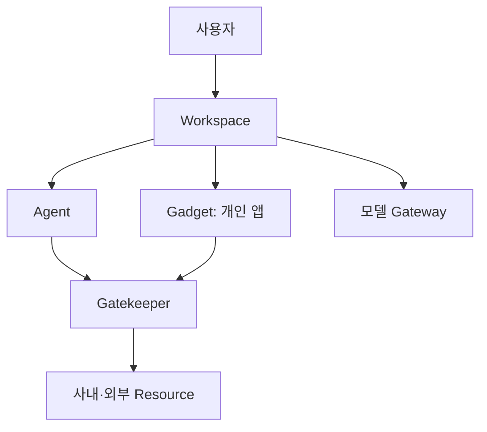

> 원문: [Cloudflare OS: an open platform for agents, apps, and work](https://blog.cloudflare.com/cloudflare-os/)

## 기업용 Agent는 채팅창 하나로 끝나지 않습니다

사내 Agent를 도입할 때 가장 먼저 만드는 것은 보통 chat UI와 모델 연결입니다. 하지만 실제 업무는 문서·데이터베이스·GitHub·SaaS·사내 API에 걸쳐 있고, Agent가 읽은 정보를 바탕으로 새 앱이나 문서를 만들기도 합니다. 이때 "로그인한 사용자의 권한으로 Agent가 일한다"는 설명만으로는 접근 범위, 공유, 외부 쓰기, 비용을 관리하기 어렵습니다.

Cloudflare OS는 이 문제를 Agent workspace, 격리된 개인 앱, capability 기반 Gatekeeper로 나누어 구현한 공개 참조 구조입니다. Cloudflare는 core와 예시 deployment를 분리해 공개했으며, 조직이 UI·연동·정책을 core patch 없이 자신의 환경에 맞게 바꾸도록 설명합니다.[^cloudflare-os-blog]

이 글의 목적은 Cloudflare OS를 그대로 도입하자는 것이 아닙니다. 기업용 Agent platform에서 어떤 경계를 먼저 설계해야 하는지, 이 구현을 통해 읽어 보는 것입니다.

## 1. Workspace는 대화 이력보다 넓은 실행 단위입니다

Cloudflare OS에서 workspace는 agent session, 지속 상태, 파일과 출력물, 연결된 resource, 격리된 code runtime을 함께 다룹니다.[^cloudflare-os-blog] 따라서 한 대화가 끝나도 결과물과 다음 작업의 문맥이 남고, Agent는 필요할 때 코드로 데이터를 검색·필터·조합할 수 있습니다.

여기서 핵심은 Agent가 모든 것을 직접 들고 있는 구조가 아니라는 점입니다.

- **Workspace**: 작업의 문맥과 소유·공유 단위입니다.
- **Gadget**: Agent가 만든 작은 개인 앱입니다. 문서·대시보드·업무 도구처럼 각자 별도 상태와 UI를 가질 수 있습니다.
- **Gatekeeper**: 외부 resource에 대한 권한과 API 경계입니다.
- **모델 Gateway**: 모델 선택, 비용 attribution, budget과 rate limit을 통제하는 경로입니다.

이 분리는 "Agent가 어떤 일을 할 수 있는가"와 "어떤 데이터·권한·비용으로 그 일을 하는가"를 같은 prompt에 섞지 않게 합니다.

## 2. Gatekeeper는 MCP 연결보다 좁은 capability를 만들려는 시도입니다

Cloudflare OS의 Gatekeeper는 외부 서비스별 Worker로, OAuth를 처리하고, 사용자가 의도한 특정 resource에만 좁은 접근을 강제하며, 행위를 기록하고, 외부 효과가 있는 작업에 사람의 승인을 둡니다.[^cloudflare-os-readme] 예를 들어 GitHub 전체 계정 token을 Agent에 전달하는 대신 특정 repository·허용된 동작을 나타내는 API를 Agent에 제공합니다.

| 흔한 연결 방식                 | Gatekeeper가 추가하려는 경계                                    |
| ------------------------------ | --------------------------------------------------------------- |
| Agent에 broad OAuth token 전달 | token은 Gatekeeper가 보관하고, Agent는 제한된 capability만 호출 |
| MCP server의 모든 tool 노출    | 특정 resource와 action을 대상으로 grant 범위를 축소             |
| write 직전에 동기 확인         | 필요한 action을 모아 사용자가 나중에 승인·거절할 수 있는 흐름   |
| 결과물 공유 시 앱 권한만 검사  | Agent가 읽은 resource에 대해 새 관찰자의 권한도 검사            |

특히 마지막 항목이 중요합니다. 민감한 테이블을 읽은 Agent가 대시보드를 만들었다면, 대시보드를 공유하는 행위가 원본 테이블의 우회 공유가 되어서는 안 됩니다. Cloudflare OS는 Agent가 관찰한 resource를 기록하고, 다른 사용자가 workspace나 결과물을 열 때 Gatekeeper가 해당 resource 접근 권한을 확인하는 방식을 설명합니다.[^cloudflare-os-blog]

이것은 제품 하나로 해결되는 문제가 아닙니다. 각 SaaS의 ACL 모델, 데이터 분류, 결과물의 정보 흐름을 정확히 연결해야 합니다. 다만 기업 Agent platform이 처음부터 **read 권한뿐 아니라 derived output의 공유**를 설계해야 한다는 점은 분명합니다.

## 3. Agent가 만든 앱은 코드 생성 기능이 아니라 격리 모델의 문제입니다

Cloudflare OS에서 Gadget은 private-by-default인 full-stack 앱입니다. Cloudflare의 설명에 따르면 client code와 server code를 가지며, server는 Dynamic Worker와 Durable Object Facet으로 로드되고 각 앱은 별도 SQLite state를 사용합니다.[^cloudflare-os-blog]

이 구조가 흥미로운 이유는 "Agent가 앱을 작성한다"보다 **실행할 수 있는 코드를 어떻게 서로 격리하는가**에 있습니다. 사용자별·Gadget별 runtime과 state가 분리되어야, 한 Agent가 만든 앱의 결함이나 과도한 권한이 다른 작업으로 퍼지는 범위를 줄일 수 있습니다.

조직에서 비슷한 기능을 만들 때는 다음을 먼저 정해야 합니다.

1. 코드 실행이 가능한지, 가능하다면 sandbox의 네트워크·filesystem·secret 범위는 어디까지인지
2. Gadget이 외부 resource를 호출할 때 user의 broad credential 대신 어떤 capability를 받는지
3. Gadget의 공유가 코드·state·대화 이력·연결 resource 중 무엇을 복제하거나 공개하는지
4. 취약한 Gadget을 중지·감사·복구하는 운영 경로가 있는지

Cloudflare OS의 blueprint는 앱을 재사용 가능한 형식으로 공유하되, 새 앱에는 원본의 SQLite data, 대화 이력, credential, 연결 resource를 넣지 않는다고 설명합니다.[^cloudflare-os-blog] 이는 코드 재사용과 데이터 공유를 같은 동작으로 취급하지 않는 좋은 기본값입니다.

## 4. FinOps는 모델 가격표가 아니라 attribution 경로에서 시작합니다

기업 Agent는 같은 모델을 쓰더라도 누가 어떤 workspace에서 어떤 tool을 써서 비용을 만들었는지 추적해야 합니다. Cloudflare OS는 inference를 AI Gateway로 보내고 request를 person·team·workspace에 귀속해 budget과 rate limit을 관리한다고 설명합니다.[^cloudflare-os-blog]

따라서 비용 제어는 다음 순서가 좋습니다.

- workspace와 Agent 실행에 비용 귀속 키를 둡니다.
- 모델별 token뿐 아니라 retrieval·외부 API·sandbox 실행 비용을 함께 봅니다.
- 업무 중요도에 맞춰 허용 모델, fallback, 일·월 예산을 정합니다.
- 예산 초과 시 단순 실패 대신 축소 모델·human approval·다음 날 재개 중 어떤 정책을 택할지 정합니다.

이 원칙은 Cloudflare Workers를 쓰지 않아도 같습니다. 모델 선택 정책은 platform이, 업무 우선순위는 제품·조직이 소유해야 합니다.

## 설계 점검표

- 대화, 파일, 생성물, 연결 resource의 소유·공유 단위가 workspace에서 명확한가?
- Agent와 생성된 앱이 받는 권한이 account-wide token이 아니라 resource-scoped capability인가?
- 외부 write는 승인·감사·되돌림 경로를 갖는가?
- Agent가 읽은 민감 데이터가 결과물 공유로 우회 노출되지 않는가?
- 코드 생성과 실행에 sandbox·secret·network 경계가 있는가?
- 모델·도구·sandbox 비용을 사용자·팀·workspace별로 설명할 수 있는가?

Cloudflare OS가 보여 주는 핵심은 Agent workspace가 새로운 chat product가 아니라는 점입니다. 조직의 문맥, 실행 환경, 권한, 공유, 비용을 한 작업 단위에서 조율하는 **업무용 control plane**에 가깝습니다. 구현 기술은 달라질 수 있어도, 이 경계들을 뒤늦게 붙이면 Agent 도입은 빠를 수 있어도 운영은 곧 어려워집니다.

[^cloudflare-os-blog]: [Cloudflare Blog, "Cloudflare OS: an open platform for agents, apps, and work"](https://blog.cloudflare.com/cloudflare-os/)

[^cloudflare-os-readme]: [cloudflare/cloudflare-os README](https://github.com/cloudflare/cloudflare-os/blob/main/README.md)
