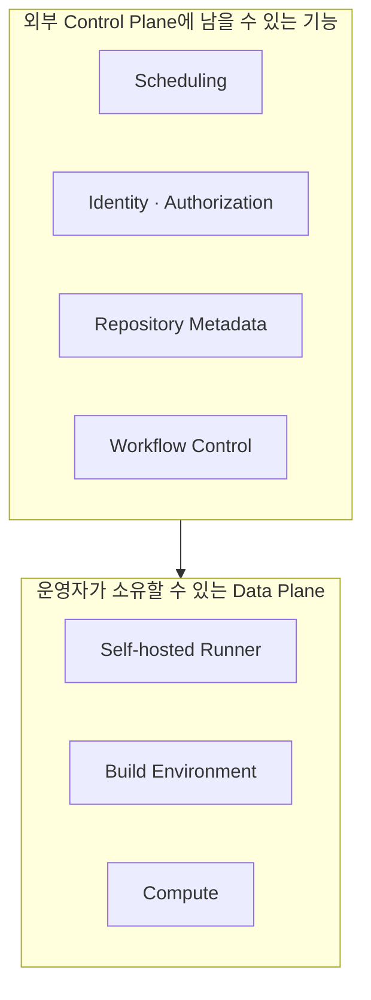

> 원문: [GitHub이 또 멈췄다 - 우리는 무엇을 GitHub에 맡기고 있나](https://news.hada.io/article/github-is-not-just-git)

## 핵심 요약

컴퓨팅 환경을 직접 운영한다고 해서 시스템 전체를 직접 통제하는 것은 아닙니다. 새 작업을 만들고 배정하며, 권한을 확인하고, 상태를 변경하고, 장애 뒤 복구를 지시하는 기능이 외부 서비스에 남아 있다면 그 기능은 외부 Control Plane에 의존합니다.

GitHub Actions의 self-hosted runner는 이 차이를 이해하기 좋은 사례입니다. Runner는 직접 운영하더라도 job 생성·queue·runner assignment에 필요한 GitHub 서비스가 멈추면 새 작업을 정상적으로 시작하지 못할 수 있습니다.

## 실행 중인 시스템과 새 작업을 제어하는 시스템은 다릅니다

Control Plane과 Data Plane은 네트워크에만 쓰는 구분이 아닙니다. AWS는 Control Plane을 리소스를 생성·조회·변경하고 그 변경을 전파하는 관리 기능으로, Data Plane을 서비스의 일상적인 핵심 동작을 수행하는 기능으로 구분합니다.[^aws-control-data-plane]

일반 시스템에도 이 구분을 적용할 수 있습니다.

| 계층 | 주된 책임 | 예시 |
| --- | --- | --- |
| Data Plane | 이미 준비된 리소스로 실제 요청을 처리합니다. | 실행 중인 compute, build, 데이터 읽기·쓰기, 캐시 응답 |
| Control Plane | 무엇을 실행하고 어디에 배치하며 누가 실행할지 결정·전파합니다. | scheduling, provisioning, identity, metadata, policy, workflow 관리 |

둘이 항상 완전히 분리되는 것은 아니며, 제품별 책임 경계도 다릅니다. 다만 “지금 실행 중인 일이 계속되는가?”와 “새 작업을 시작·변경·복구할 수 있는가?”는 서로 다른 질문입니다. AWS도 복구 절차에서 Control Plane 작업을 최소화하고 Data Plane 기능을 우선하라고 권고합니다.[^aws-recovery]



## Self-hosted Runner가 제공하는 통제와 남는 의존성

GitHub은 self-hosted runner를 사용자가 배포·관리하며 GitHub Actions job을 실행하는 시스템으로 정의합니다.[^github-self-hosted-runner] 운영자는 hardware, 운영체제, 설치 도구, 네트워크 접근, 실행 비용을 선택할 수 있습니다. 내부 네트워크의 서비스에 접근해야 하거나 특수한 build 환경이 필요한 작업에서 특히 유용할 수 있습니다.

그러나 runner 장비를 소유한다는 사실만으로 CI/CD 전체가 GitHub와 독립되지는 않습니다. GitHub Actions를 Control Plane으로 계속 쓰는 경우 일반적으로 다음 기능은 GitHub 서비스와 연결됩니다.

- repository event가 workflow run과 job을 만드는 흐름
- runner에 job을 배정하는 queue와 scheduling
- repository, workflow, runner group, 권한 정책의 metadata와 authorization
- workflow 상태, artifact, 보호 규칙을 관리하는 경로

정확한 경계는 구성, 플랜, runner 관리 방식, artifact·secret 서비스에 따라 달라집니다. 따라서 “self-hosted인가”보다 **어떤 실행·복구 기능을 누가 제공하고, 장애 때 어떤 대체 경로가 있는가**를 목록화해야 합니다.

## GitHub Actions 장애를 의존성 분석 사례로 읽습니다

2026년 8월 GitHub Actions 장애의 사후 보고서는 workflow run이 실패하거나 오랫동안 queue에 남았고, GitHub-hosted와 self-hosted runner를 모두 쓰는 고객이 영향을 받았다고 기록합니다.[^github-actions-incident] 이 사례에서 중요한 점은 runner 장비의 위치가 아니라, event 처리·job 생성·assignment처럼 실행 전 필요한 Control Plane 기능이 영향을 받았다는 것입니다.

```text
Repository event
  → workflow / job 생성
  → queue와 runner assignment
  → runner 인증·job 수신
  → self-hosted compute에서 실행
```

마지막 단계의 compute를 소유해도 앞 단계가 멈추면 새 작업이 시작되지 않을 수 있습니다. 반대로 이미 시작된 job, 독립 scheduler로 시작할 수 있는 작업, 별도로 확보한 artifact와 credential을 쓰는 작업은 다른 특성을 보일 수 있습니다. 사례의 목적은 GitHub Actions가 항상 취약하다고 일반화하는 것이 아니라, 의존성을 기능 단위로 분석하는 방법을 보여 주는 데 있습니다.

## `Self-hosted ≠ Independent`는 조건부 원칙입니다

“self-hosted는 독립적이지 않다”라는 문장은 지나치게 강하면 틀립니다. source repository, event source, scheduler, identity, artifact repository, secret distribution, deployment control까지 직접 운영하면 외부 의존성은 줄어듭니다.

더 정확한 원칙은 다음과 같습니다.

> Data Plane 일부를 소유해도, 중요한 실행·복구 기능이 외부 Control Plane에 남아 있으면 그 기능에 대해서는 독립적이지 않습니다.

이 원칙은 제품 선택의 찬반이 아니라, 설계 질문입니다.

| 질문 | 확인할 내용 |
| --- | --- |
| 누가 작업을 시작시키는가? | webhook, scheduler, queue, manual trigger의 소유자와 대체 경로 |
| 누가 identity를 확인하는가? | IdP, token issuer, repository authorization, secret access |
| 누가 상태와 metadata를 보관하는가? | workflow, deployment, runner, artifact, audit log의 source of truth |
| 누가 복구를 지시하는가? | failover, scale-out, replay, rollback에 필요한 Control Plane API |
| 외부 서비스가 멈추면 무엇이 계속되는가? | 이미 실행 중인 작업, cached artifact, read-only 기능, 수동 절차 |

## 제한된 기능으로 운영하고, 대체·복구 준비도를 갖춥니다

Control Plane 의존성을 전부 제거하는 비용은 큽니다. 그래서 모든 SaaS를 대체하는 것보다 장애 중에도 어떤 최소 업무를 유지할지 먼저 정하는 편이 현실적입니다.

1. **안전한 정지**: 새 배포와 파괴적 변경을 멈추고, 이미 동작하는 서비스는 유지합니다.
2. **수동 실행**: 검증된 script와 제한된 credential로 필요한 build·검증·rollback만 수행합니다.
3. **대체 경로**: 별도 scheduler나 다른 CI가 필요한 source·artifact·secret에 접근해 제한된 작업을 수행합니다.
4. **정상 복귀**: 원래 Control Plane이 회복된 뒤 queue, 상태, deployment 기록을 맞춥니다.

대체·복구 준비도는 언젠가 제품을 이전할 수 있는지만 뜻하지 않습니다. 장애 중에도 최소 업무를 수행할 수 있는지, 그 절차가 실제로 검증됐는지를 뜻합니다.

## 같은 질문은 다른 관리형 서비스에도 적용됩니다

| 시스템 | 소유하기 쉬운 Data Plane | 별도로 점검할 Control Plane |
| --- | --- | --- |
| Kubernetes | worker node와 workload | API server, scheduler, admission, cluster metadata |
| Cloud provider | 실행 중인 VM·container·storage | provisioning, IAM, network·quota 변경, managed API |
| Managed database | 연결 중인 애플리케이션과 일부 복제본 | failover 정책, schema·backup 관리, identity |
| CDN | 이미 배포된 edge cache | purge, routing, certificate·configuration 변경 |
| SaaS와 IdP | 이미 발급된 세션 또는 cached data | 로그인, token 발급, 권한·directory 동기화 |

이 표는 모든 시스템이 같은 장애 특성을 가진다는 뜻이 아닙니다. compute 위치만 보지 않고, 실제 실행과 복구를 가능하게 하는 Control Plane 기능별 의존성을 살피라는 질문 목록입니다.

[^aws-control-data-plane]: [AWS, "Control planes and data planes"](https://docs.aws.amazon.com/whitepapers/latest/aws-fault-isolation-boundaries/control-planes-and-data-planes.html)
[^aws-recovery]: [AWS Well-Architected Framework, "Rely on the data plane and not the control plane during recovery"](https://docs.aws.amazon.com/wellarchitected/2025-02-25/framework/rel_withstand_component_failures_avoid_control_plane.html)
[^github-self-hosted-runner]: [GitHub Docs, "Self-hosted runners"](https://docs.github.com/en/actions/concepts/runners/self-hosted-runners)
[^github-actions-incident]: [GitHub Status, "Incident with Actions" (2026-08-06–07)](https://www.githubstatus.com/incidents/qcvjkzcs7j74)
