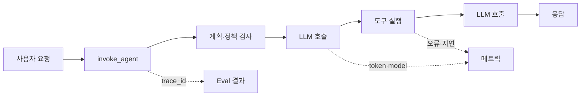

## Agentic Harness에서 먼저 구분할 것: monitoring과 observability

Agent가 고객의 질문을 받으면 모델을 호출하고, 검색·데이터베이스·사내 API 같은 도구를 선택하며, 필요하면 다시 계획을 세웁니다. 사용자는 단 하나의 답변만 보지만, 운영자는 그 뒤에서 일어난 여러 단계의 실행을 이해해야 합니다. 이 글에서는 이 실행 경로를 **Agentic Harness**라고 부르겠습니다. 즉, Agent를 감싸며 요청을 받아 모델·도구·메모리·정책·재시도를 조율하는 애플리케이션 계층입니다.

이때 monitoring과 observability를 같은 말처럼 쓰기 쉽습니다. 둘은 서로 대체하는 관계가 아니라 역할이 다릅니다.

| 구분              | 먼저 답하려는 질문                  | Agentic Harness 예시                                                                         |
| ----------------- | ----------------------------------- | -------------------------------------------------------------------------------------------- |
| **Monitoring**    | 미리 정한 상태가 정상 범위인가?     | `p95` 응답 시간이 10초를 넘었는가? 도구 오류율이 2%를 넘었는가? 일일 비용 예산을 초과했는가? |
| **Observability** | 예상하지 못한 문제가 왜 일어났는가? | 특정 고객 요청이 느린 이유가 모델 추론, 검색, 도구 재시도, 혹은 잘못된 계획 때문인가?        |

OpenTelemetry는 observability를 시스템의 출력을 살펴 내부 상태를 이해하는 능력으로 설명하고, 특히 미리 정의하지 못한 문제(`unknown unknowns`)를 조사할 수 있어야 한다고 봅니다.[^otel-observability-primer] 따라서 monitoring은 운영을 시작하는 데 필요한 경보와 대시보드이고, observability는 경보가 울렸을 때 **요청 하나를 끝까지 따라가며 원인을 설명할 수 있는 상태**에 가깝습니다.

LLM 시스템에서는 이 차이가 더 커집니다. HTTP `500`이나 CPU 사용률만으로는 "모델이 잘못된 도구를 골랐는지", "도구는 성공했지만 결과를 잘못 해석했는지", "같은 요청을 세 번 다시 시도해 비용이 커졌는지"를 알기 어렵습니다. Agent의 결과는 확률적이고 실행 경로도 입력에 따라 달라지므로, 집계 지표와 함께 요청 단위의 인과관계를 남겨야 합니다.

## 1. 일반 분산 추적보다 한 단계 더 많은 질문이 필요합니다

일반적인 웹 서비스 trace는 `HTTP 요청 → 서비스 → 데이터베이스`의 지연과 오류를 설명하는 데 적합합니다. Agentic Harness는 여기에 **의사결정과 비용이 있는 작업 단위**를 추가합니다.



이 다이어그램에서 `invoke_agent`는 사용자가 체감하는 하나의 작업을 뜻하는 root span입니다. 그 아래의 모델 호출, retrieval, 도구 실행, 재시도는 자식 span으로 만듭니다. OpenTelemetry trace는 하나 이상의 span으로 이루어지고, span은 시작·종료 시각과 구조화된 속성을 가진 하나의 작업 단위를 표현합니다.[^otel-traces] 이 부모-자식 관계가 있어야 전체 18초 중 모델에 3초, 사내 검색에 14초가 걸렸다는 식으로 병목을 설명할 수 있습니다.

Agent trace에는 최소한 다음 질문의 답을 남기는 편이 좋습니다.

- **무엇을 실행했는가**: agent/workflow 이름과 버전, 모델과 배포 이름, 도구 이름, operation 종류
- **어떤 경로였는가**: 계획 단계, retrieval, tool call, 재시도, fallback 모델 전환의 순서와 횟수
- **어떤 결과였는가**: 성공·실패·취소·안전 정책 차단, 도구의 오류 분류, 최종 응답의 상태
- **얼마나 들었는가**: 단계별 시간, 입력·출력 token, provider가 제공한다면 cache·reasoning token, 추정 비용
- **사후에 품질이 어땠는가**: 정답성·근거성·안전성·사용자 피드백 같은 eval 결과

모든 프롬프트와 도구 결과를 무조건 span attribute에 넣는 것은 좋은 기본값이 아닙니다. 질의에는 개인정보와 비밀값이, tool result에는 고객 데이터와 인증 정보가 들어갈 수 있습니다. OpenTelemetry도 데이터 최소화와 민감 속성의 제거·마스킹을 권고합니다.[^otel-sensitive-data] 기본 trace에는 식별자·길이·상태·집계 정보만 남기고, 원문은 명시적 opt-in, 권한 분리, 보존 기간, redaction 규칙이 준비된 경우에만 제한적으로 보관합니다.

## 2. LLM과 tool trace는 이름보다 경계를 먼저 정합니다

관찰성의 품질은 span 이름을 멋지게 붙이는 데서 나오지 않습니다. 실제로 독립적인 실패·재시도·비용이 생기는 경계를 나누는 데서 나옵니다. 다음은 TypeScript 서버에서 수동 계측할 때의 개념 예시입니다.

```ts
import { trace, SpanStatusCode } from "@opentelemetry/api";

const tracer = trace.getTracer("support-agent", "2026-08-24");

export async function answerQuestion(question: string, requestId: string) {
  return tracer.startActiveSpan("invoke_agent", async (agentSpan) => {
    agentSpan.setAttributes({
      "app.agent.name": "support-agent",
      "app.agent.version": "2026-08-24",
      "app.request.id": requestId,
    });

    try {
      const plan = await createPlan(question); // 내부에서 LLM span 생성
      const toolResult = await tracer.startActiveSpan(
        "execute_tool",
        async (toolSpan) => {
          toolSpan.setAttributes({
            "gen_ai.operation.name": "execute_tool",
            "gen_ai.tool.name": plan.toolName,
          });

          try {
            return await runTool(plan);
          } catch (error) {
            toolSpan.recordException(error as Error);
            toolSpan.setStatus({ code: SpanStatusCode.ERROR });
            throw error;
          } finally {
            toolSpan.end();
          }
        },
      );

      return await createAnswer(question, toolResult); // 모델·token 속성 기록
    } finally {
      agentSpan.end();
    }
  });
}
```

예시의 `app.agent.*`는 조직이 정한 애플리케이션 속성입니다. `gen_ai.*`는 OpenTelemetry GenAI 의미 규약의 이름을 따릅니다. 규약에는 `invoke_agent`, `execute_tool`, `retrieval` 같은 operation과 input/output token, tool call, workflow를 표현하는 항목이 있으며, 표준화 작업은 현재도 진행 중입니다.[^otel-genai-attributes][^otel-agent-observability] 따라서 실제 도입에서는 사용하는 SDK와 exporter가 내보내는 규약 버전을 고정하고, 아직 development 상태인 속성은 이름이나 구조가 바뀔 수 있다는 전제로 래퍼를 두는 편이 안전합니다.

span 경계를 다음처럼 잡으면 조사할 수 있는 문제도 분명해집니다.

| 경계                  | span으로 남길 이유                                | 주로 확인할 속성                                          |
| --------------------- | ------------------------------------------------- | --------------------------------------------------------- |
| `invoke_agent`        | 한 사용자 작업의 성공·시간·비용을 묶는다.         | agent 버전, 요청 종류, 최종 상태, 총 비용                 |
| `chat` 또는 모델 호출 | 모델·배포·설정별 지연과 token 소비를 비교한다.    | request/response model, input/output token, finish reason |
| `retrieval`           | 검색 품질·지연·문서 수를 분리한다.                | index, 결과 수, score 요약, 오류                          |
| `execute_tool`        | 외부 API 실패와 잘못된 도구 선택을 구분한다.      | tool 이름, 대상 시스템, 재시도 수, 오류 종류              |
| `policy_check`        | 차단·수정·fallback이 제품 규칙 때문인지 확인한다. | 정책 버전, 결정 결과, 이유 코드                           |

사용자 질문, 완전한 프롬프트, 도구 인수처럼 cardinality가 크고 민감할 수 있는 값은 검색용 attribute로 쓰지 않습니다. 대신 `prompt_template_id`, `tool_name`, `model`, `outcome`, `error_type`처럼 값의 범위가 작고 집계 가능한 차원을 우선합니다. 원문이 꼭 필요하다면 trace ID와 별도 접근 통제된 저장소를 연결하는 편이 더 안전하고 관리하기 쉽습니다.

## 3. Token·비용·latency는 같은 대시보드에서 보되, 같은 지표는 아닙니다

Agent의 운영비는 모델 호출 횟수만으로 설명되지 않습니다. 입력 token, 출력 token, cache hit, reasoning token, retrieval·도구 호출, 재시도가 함께 변합니다. OpenTelemetry GenAI 규약은 입력·출력·reasoning token 사용량과 모델 식별을 위한 속성을 정의하고 있고,[^otel-genai-attributes] 공식 예시도 token usage와 operation duration을 모델별로 나누어 관찰하는 방식을 보여 줍니다.[^otel-genai-observability]

다만 provider의 청구 단위와 telemetry의 token 값은 항상 1:1이 아닙니다. batch·cache·region·계약 할인·월말 정산이 다를 수 있기 때문입니다. 그래서 비용 지표는 다음 두 층으로 나누는 편이 좋습니다.

1. **추정 비용**: trace의 token·도구 사용량에 현재 가격표를 적용합니다. 요청 직후 예산 경보와 모델·프롬프트 비교에 쓸 수 있습니다.
2. **청구 비용**: provider invoice 또는 usage export와 대조합니다. 재무 보고와 추정식 보정에 씁니다.

예를 들어 특정 모델의 요청당 추정 비용은 아래처럼 계산할 수 있습니다. 단가는 모델·지역·계약에 따라 달라지므로 코드나 대시보드의 설정값으로 관리해야 합니다.

```ts
const estimatedCostUsd =
  (inputTokens / 1_000_000) * inputPricePerMillion +
  (outputTokens / 1_000_000) * outputPricePerMillion +
  toolCostUsd;
```

FinOps 관점에서는 평균 비용만 보지 않습니다. `agent_version`, `model`, `request_type`, `tenant_tier`처럼 의사결정에 필요한 낮은 cardinality 차원으로 다음을 함께 봅니다.

- 요청당 비용의 중앙값과 `p95`: 소수의 retry loop가 예산을 지배하는지 확인합니다.
- 성공 요청당 비용: 실패한 반복 호출을 숨기지 않습니다.
- 모델·프롬프트 버전별 token 변화: 품질 개선이 비용 증가를 정당화하는지 비교합니다.
- 도구 호출당 비용과 오류율: 모델 비용 절감이 더 비싼 외부 API 호출로 바뀌지 않았는지 확인합니다.

latency도 하나의 숫자로 합치지 않습니다. 사용자가 기다린 end-to-end 시간, 첫 token까지의 시간, 모델 생성 시간, tool 대기 시간, retry 대기 시간을 분리해야 합니다. 예를 들어 모델을 더 빠른 것으로 바꿨는데 전체 응답이 그대로라면, 느린 사내 검색이나 직렬 tool call이 실제 병목일 수 있습니다.

## 4. Evals는 trace를 대체하지 않고, trace에 품질의 의미를 더합니다

trace는 "무슨 경로로 실행됐는가"를 잘 보여 주지만, "답변이 실제로 유용했는가"를 보장하지는 않습니다. 오류 없이 짧고 저렴하게 끝난 응답도 잘못된 근거를 만들 수 있습니다. 이 빈칸을 메우는 것이 eval입니다.

eval을 모든 요청에 거대한 정답 데이터셋으로 적용할 필요는 없습니다. 먼저 제품의 실패 비용에 맞는 작은 평가 계약을 만듭니다.

| 제품 성격         | 우선 eval 예시                                  | trace와 연결할 키                             |
| ----------------- | ----------------------------------------------- | --------------------------------------------- |
| 고객 지원         | 해결 여부, 근거 문서 일치, escalation 필요 여부 | `trace_id`, prompt/agent 버전, 문서 집합 버전 |
| 데이터 조회 Agent | 권한 준수, SQL/API 실행 정확성, 결과 형식       | `trace_id`, tool 이름, policy 결과            |
| 코드 Agent        | 테스트 통과, 변경 범위, 보안 검사               | `trace_id`, repository/revision, test 결과    |

여기서 중요한 것은 eval 결과를 독립적인 **사후 이벤트**로 기록하는 일입니다. 사람이 검토하거나 배치 평가가 끝난 뒤에도 같은 `trace_id`로 결과를 붙일 수 있어야 합니다. 그러면 "새 프롬프트는 비용을 18% 줄였지만 근거성 점수를 떨어뜨렸다"처럼 운영·품질·비용을 같은 release 후보에서 비교할 수 있습니다. 이 수치는 보편적 기준이 아니라, 각 팀이 자신의 평가셋과 실험에서 확인해야 할 의사결정 신호입니다.

LLM judge를 쓰더라도 최종 판정으로 간주하지 말고, 표본 human review로 결과를 보정합니다. 특히 안전·법률·의료·금융처럼 오류 비용이 높은 영역에서는 자동 평가 점수만으로 release gate를 통과시키지 않는 편이 안전합니다.

## 5. Production에서 흔히 놓치는 네 가지

### 1) "전부 기록"은 관찰성이 아니라 데이터 위험을 키울 수 있습니다

프롬프트와 tool result는 디버깅에 매력적이지만, 그 자체로 개인정보·인증 정보·영업 비밀일 수 있습니다. 수집 목적을 먼저 정하고 allowlist 기반 attribute, hash 또는 토큰화한 사용자 식별자, 길이 제한, 보존 기간, 접근 감사, Collector 단계 redaction을 함께 적용합니다. OpenTelemetry도 민감 데이터는 수집하지 않는 것이 최선이며, 필요한 경우 filter·redaction·transform processor를 사용하도록 안내합니다.[^otel-sensitive-data]

### 2) 높은 cardinality는 검색과 비용을 무너뜨립니다

`user_id`, 원문 질문, URL 전체, 임의의 tool argument를 metric label로 사용하면 시계열 수가 빠르게 늘어납니다. metric에는 집계에 필요한 작은 차원만 남기고, 한 요청을 자세히 조사하는 일은 sampled trace와 로그의 trace ID 상관관계에 맡깁니다. OpenTelemetry log는 trace/span ID로 로그와 trace를 연결할 수 있도록 설계되어 있습니다.[^otel-logs-correlation]

### 3) 샘플링은 실패와 비용 이상치를 잃지 않게 설계합니다

성공 요청을 전부 장기 보관하는 것은 비쌀 수 있습니다. 그렇다고 균일한 비율로만 샘플링하면 느린 요청, 오류, 정책 차단, 예산 초과, 낮은 eval 점수 같은 중요한 사례가 사라질 수 있습니다. 기본 성공 trace는 낮은 비율로 두되, 오류·느린 요청·고비용·새 agent 버전·낮은 eval 점수는 우선 보존하는 규칙을 둡니다. 시작 시점에 알 수 없는 최종 비용과 eval은 collector 또는 backend에서 tail-based 규칙으로 다루는 방식을 검토할 수 있습니다.

### 4) 지표의 소유자를 분리하지 않으면 아무도 개선하지 않습니다

모델 팀은 token, 플랫폼 팀은 exporter, 제품 팀은 해결률만 바라보면 실패가 팀 경계에 방치됩니다. `agent_version`을 공통 조인 키로 삼고, release마다 다음 항목을 하나의 scorecard로 합의하면 좋습니다.

- 품질: task success, groundedness, 안전 위반률
- 신뢰성: 오류율, timeout, fallback 비율
- 성능: end-to-end `p50`/`p95`, tool 대기 시간
- 비용: 성공 요청당 비용, token, 도구 비용
- 운영: 관찰 불가능한 요청 비율, redaction 실패 수

## 배포 전 점검표

- 한 사용자 요청을 대표하는 root span과 모델·도구·재시도 자식 span이 연결되는가?
- monitoring 경보가 답하는 질문과, trace가 조사할 질문을 구분했는가?
- 모델·prompt·agent·policy 버전을 비교 가능한 낮은 cardinality 속성으로 남기는가?
- token과 추정 비용의 계산식·가격표 버전을 기록하고, 청구 데이터와 정기적으로 대조하는가?
- eval 결과가 request/trace ID와 연결되어 품질·비용·지연을 함께 비교할 수 있는가?
- 프롬프트·도구 결과의 opt-in, redaction, 보존 기간, 접근 권한이 결정되었는가?
- 오류·고비용·느린 요청을 놓치지 않는 샘플링 규칙이 있는가?

Agentic Harness의 observability는 대시보드를 하나 더 만드는 일이 아닙니다. 정상 범위를 빠르게 알리는 monitoring 위에, 예상하지 못한 결과를 설명할 수 있는 실행 맥락을 쌓는 일입니다. 하나의 요청에서 모델·도구·재시도·비용·평가가 같은 trace로 연결될 때, 팀은 "Agent가 느리다"는 막연한 인상 대신 어느 경로를 고치고 어떤 품질·비용을 감수할지 결정할 수 있습니다.

[^otel-observability-primer]: [OpenTelemetry, "Observability primer"](https://opentelemetry.io/docs/concepts/observability-primer/)

[^otel-traces]: [OpenTelemetry, "Traces"](https://opentelemetry.io/docs/concepts/signals/traces/)

[^otel-sensitive-data]: [OpenTelemetry, "Handling sensitive data"](https://opentelemetry.io/docs/security/handling-sensitive-data/)

[^otel-genai-attributes]: [OpenTelemetry, "GenAI semantic conventions"](https://opentelemetry.io/docs/specs/semconv/registry/attributes/gen-ai/)

[^otel-agent-observability]: [OpenTelemetry, "AI Agent Observability - Evolving Standards and Best Practices"](https://opentelemetry.io/blog/2025/ai-agent-observability/)

[^otel-genai-observability]: [OpenTelemetry, "Inside the LLM Call: GenAI Observability with OpenTelemetry"](https://opentelemetry.io/blog/2026/genai-observability/)

[^otel-logs-correlation]: [OpenTelemetry, "Logging: Log correlation"](https://opentelemetry.io/docs/specs/otel/logs/#log-correlation)
