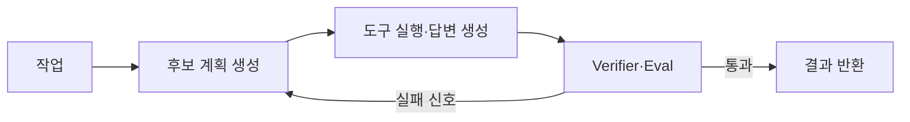

> 원문: [Stanford CS329A: Self-Improving AI Agents](https://cs329a.stanford.edu/)

## 핵심 요약

Self-improving Agent는 모델이 저절로 학습하는 기능이 아니라, 작업 결과를 신뢰할 수 있게 검증하고 그 실패 신호를 다음 시도에 연결하는 시스템입니다. 실무에서는 더 큰 모델이나 복잡한 multi-agent 구조보다, 측정 가능한 task·강한 verifier·좁은 tool contract·관찰 가능한 실행 고리를 먼저 갖춰야 개선을 비용과 품질로 설명할 수 있습니다.

## Self-improving은 "스스로 더 똑똑해진다"는 뜻만이 아닙니다

Agent가 스스로 개선된다고 하면, 모델이 대화하면서 자동으로 학습한다고 생각하기 쉽습니다. 그러나 실제 시스템에서 개선은 더 구체적인 피드백 고리입니다. 작업을 수행하고, 결과를 검증하고, 더 나은 경로를 선택하거나 다음 실험의 입력으로 삼는 과정입니다. 검증할 수 없는 결과는 개선 신호가 되기 어렵습니다.

Stanford CS329A는 이 고리를 LLM self-improvement에서 시작해 verifier, test-time compute, search, tool use, retrieval, multi-step reasoning, planning, evaluation, orchestration, coding agent와 robotics까지 연결합니다.[^cs329a-bulletin] 강의 하나를 모두 따라가는 것보다, 이 순서를 Agent를 만드는 개발자의 학습 지도로 활용할 수 있습니다.

## 1. 개선의 출발점은 생성기가 아니라 verifier입니다

모델이 답변을 여러 개 만들 수 있어도 무엇이 좋은 답인지 판별하지 못하면, 반복 생성은 비용만 늘릴 수 있습니다. CS329A가 constitutional AI와 learned/domain-specific verifier를 초반에 두는 이유도 여기에 있습니다.[^cs329a-bulletin]

verifier는 꼭 또 다른 LLM일 필요가 없습니다. 문제에 따라 더 강한 판정기를 쓸 수 있습니다.

| 작업        | 우선 verifier                                           | LLM judge만으로 부족한 이유                   |
| ----------- | ------------------------------------------------------- | --------------------------------------------- |
| 코드 수정   | compiler, unit/integration test, static analysis        | 말로 된 설명이 test 통과를 보장하지 않음      |
| 데이터 조회 | schema 검증, 권한 검사, 결과 비교                       | 형식이 그럴듯해도 잘못된 row를 반환할 수 있음 |
| 문서 답변   | 인용 문서 존재, claim-grounding 검사, human review 표본 | 유창성이 사실성을 보장하지 않음               |
| 업무 자동화 | policy rule, side-effect audit, human approval          | 실행 성공이 업무상 허용을 뜻하지 않음         |

좋은 verifier는 "정답 여부"만 반환하지 않습니다. 실패한 위치와 다음 시도에 쓸 제약도 남깁니다. 예를 들어 코드 Agent라면 test failure, lint 결과, 변경한 file 목록, 실행하지 못한 test의 이유가 다음 계획의 입력이 됩니다.

## 2. Test-time compute는 모델 호출을 늘리는 기술이 아니라 탐색 예산입니다

CS329A는 test-time compute scaling과 search+LLM을 함께 다룹니다.[^cs329a-bulletin] 이때 test-time compute는 같은 질문에 더 오래 생각하거나, 여러 후보·도구 호출·계획을 평가하는 추가 계산 예산으로 이해하면 됩니다.

이 고리는 항상 길수록 좋지 않습니다. 후보 수와 tool retry를 늘리면 성공률이 오를 수 있지만, latency와 cost도 함께 커집니다. 따라서 production에서는 다음을 함께 기록해야 합니다.

- task 종류별 성공률과 verifier 통과율
- 후보 수, retry 횟수, tool call 횟수
- end-to-end latency와 성공 요청당 비용
- fallback이나 human escalation 비율

앞선 관찰성 글에서 다룬 trace와 eval은 여기서 직접 쓰입니다. 탐색이 실패한 이유가 모델 성능인지, 부족한 context인지, tool 오류인지, verifier의 과도한 제한인지 구분하지 못하면 개선 투자도 방향을 잃습니다.

## 3. Tool use와 retrieval은 지식 추가가 아니라 행동 경계를 늘립니다

모델만 쓰는 작업은 입력 text와 출력 text의 문제로 제한됩니다. retrieval은 외부 근거를 가져오고, tool use는 검색·계산·파일 수정·API 호출처럼 실제 환경에 영향을 미치는 행동을 추가합니다. CS329A는 이 확장을 multimodal web interaction과 orchestration의 맥락으로 다룹니다.[^cs329a-bulletin]

이 단계에서 Agent 설계의 질문도 바뀝니다.

- 모델이 어떤 tool을 선택했는가?
- tool input은 schema와 권한 범위 안에 있는가?
- 결과가 실패·부분 성공·오래된 데이터일 때 다음 계획은 무엇인가?
- side effect가 있으면 누가 언제 승인하는가?

Tool을 많이 붙이는 것만으로 Agent가 좋아지지는 않습니다. 각 도구의 입력·출력·권한·실패 계약을 작게 만들고, 계획과 실행을 trace로 연결해야 문제를 고칠 수 있습니다.

## 4. Planning과 orchestration은 "여러 Agent"보다 작업 분해의 문제입니다

긴 작업은 한 번의 모델 호출로 끝나지 않습니다. 목표를 단계로 나누고, 중간 결과를 확인하고, 실패하면 되돌리거나 다른 방법을 골라야 합니다. CS329A가 multi-step reasoning/planning과 robust evaluation/orchestration을 별도 주제로 두는 이유입니다.[^cs329a-bulletin]

처음부터 multi-agent architecture를 만들 필요는 없습니다. 다음 순서가 보통 더 안전합니다.

1. 하나의 Agent가 수행할 수 있는 작은 end-to-end task를 정의합니다.
2. 각 단계의 입력·출력·성공 조건·side effect를 명시합니다.
3. 단계마다 verifier와 rollback 또는 escalation 조건을 둡니다.
4. 병렬화가 실제로 필요한 독립 작업만 분리합니다.
5. Agent를 늘린 뒤에는 coordinator의 정책·비용·권한까지 평가합니다.

Orchestration은 여러 모델 호출을 연결하는 기술이기도 하지만, 더 본질적으로는 책임을 배분하는 설계입니다. planner가 무엇을 결정하고, executor가 어디까지 실행하며, verifier가 언제 중단시키는지가 불분명하면 Agent 수가 늘수록 원인을 찾기 어려워집니다.

## 5. 강의 자료를 실무 학습 계획으로 바꾸는 방법

CS329A의 공식 페이지는 Autumn 2025 강의 일정과 읽을거리를 제공하며, 초반에는 test-time compute scaling을 다룹니다.[^cs329a-course] 이를 실무자는 다음 네 단계로 재구성해 볼 수 있습니다.

| 단계     | 만들어 볼 최소 산출물           | 다음 단계로 갈 조건                            |
| -------- | ------------------------------- | ---------------------------------------------- |
| Verifier | 작은 task와 자동 test 10~30개   | 실패 이유를 기계적으로 분류할 수 있음          |
| Search   | 후보 2~3개를 생성·평가하는 loop | 단일 호출보다 나은 조건이 측정됨               |
| Tool use | 권한이 좁은 read-only tool 하나 | schema·오류·trace가 갖춰짐                     |
| Planning | verifier가 있는 다단계 workflow | 비용·latency·품질의 trade-off를 설명할 수 있음 |

마지막 단계는 "더 큰 모델"이 아닙니다. 실제 사용자의 task에서 verifier, 데이터, tool contract, 운영 지표 중 무엇이 병목인지 파악하는 일입니다. Stanford 과정이 연구·산업 응용을 함께 다루는 이유도 Agent 개선이 단일 모델의 문제로 끝나지 않기 때문입니다.[^cs329a-bulletin]

Self-improving Agent를 만들기 위한 가장 현실적인 출발점은 모델이 스스로 배울 것이라는 기대가 아닙니다. **측정 가능한 task, 신뢰할 수 있는 verifier, 좁은 도구 경계, 관찰 가능한 실행 고리**를 만드는 일입니다. 이 네 가지가 있어야 더 많은 test-time compute와 더 복잡한 orchestration이 실제 개선으로 이어집니다.

[^cs329a-bulletin]: [Stanford University Bulletin, "CS329A: Self Improving AI Agents"](https://bulletin.stanford.edu/courses/2263721)

[^cs329a-course]: [Stanford CS329A course site](https://cs329a.stanford.edu/)
