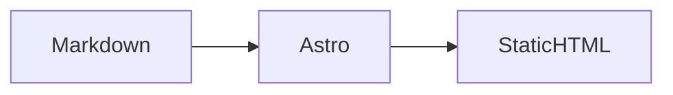

정적 블로그의 글은 Markdown으로 관리하면 변경 이력과 검토 흐름을 함께 가져갈 수 있습니다. 다만 다이어그램까지 브라우저에서 실행하면 첫 화면이 늦어지고, 문법 오류를 배포 뒤에 발견할 수 있습니다.

## 빌드 단계에서 검증하기

이 블로그는 Markdown을 정적 HTML로 바꾸는 과정에서 Mermaid도 SVG로 렌더링합니다. 잘못된 다이어그램은 빌드가 실패하므로 공개 전에 고칠 수 있습니다.

```ts
const posts = getPublishedPosts(await getCollection("blog"));
const pagePaths = posts.map((post) => `/${post.id}/`);
```



이 방식은 글 작성자는 코드 블록처럼 다이어그램을 작성하고, 방문자는 별도 JavaScript 실행 없이 결과 SVG를 바로 받게 합니다.
