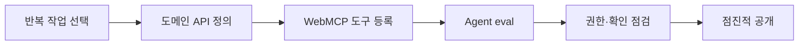

> 원문: [WebMCP API Proposal](https://webmachinelearning.github.io/webmcp/docs/proposal.html)

## Agent에게 DOM을 읽게 할 것인가, 의도를 알려 줄 것인가

브라우저 Agent는 보통 화면을 읽고, DOM을 해석하고, 버튼을 찾아 클릭합니다. 사람에게는 자연스러운 흐름이지만, UI 구조·문구·레이아웃이 바뀔 때마다 자동화가 흔들립니다. 예약 버튼을 누르는 작업이라도 Agent는 "어느 버튼이 실제 예약인가", "다음 화면은 확인인가 결제인가"를 매번 추론해야 합니다.

**WebMCP**는 이 문제를 웹 애플리케이션이 직접 해결하자는 제안입니다. 페이지가 Agent가 사용할 수 있는 작업을 이름, 설명, 입력 schema, 실행 함수로 브라우저에 등록합니다. Agent는 화면 좌표나 CSS selector 대신 구조화된 계약을 보고 인수를 전달합니다.[^webmcp-proposal]

다만 WebMCP는 웹의 모든 상호작용을 대체하는 표준 API가 아닙니다. 현재 제안 단계의 Web API이며, 브라우저 지원과 정책은 변할 수 있습니다. 따라서 지금은 기존 form/API의 보안 모델을 유지한 채, 오류 비용이 낮고 의도가 명확한 작업부터 시험하는 편이 적절합니다.[^chrome-webmcp]

## 1. WebMCP, MCP, 브라우저 자동화는 서로 다른 경계에 있습니다

| 방식            | 계약을 제공하는 곳 | Agent가 주로 보는 것                      | 잘 맞는 경우                                                     |
| --------------- | ------------------ | ----------------------------------------- | ---------------------------------------------------------------- |
| 브라우저 자동화 | 제공자 없음        | 화면·DOM·접근성 트리                      | 기존 사이트를 바꾸지 못할 때                                     |
| **WebMCP**      | 현재 열린 웹페이지 | 페이지가 등록한 JavaScript 도구           | 사용자 세션 안에서 페이지 기능을 안전하게 노출할 때              |
| MCP             | 외부 서버·서비스   | server가 제공하는 tools/resources/prompts | 데이터베이스, SaaS, 사내 서비스처럼 브라우저 밖 기능을 연결할 때 |

WebMCP는 MCP의 도구라는 개념과 닮았지만, transport를 하나 더 만드는 방식은 아닙니다. 제안서에서 MCP는 Agent client와 외부 server 사이의 계층형 프로토콜이고, WebMCP의 도구는 페이지가 브라우저에 제공하는 JavaScript 실행 경로입니다.[^webmcp-proposal] 브라우저는 도구를 Agent에 전달하면서 페이지 URL, title, origin 권한 범위도 함께 다룹니다.[^chrome-webmcp]

따라서 둘은 경쟁 관계보다 연결 지점이 다릅니다. 예를 들어 여행 사이트는 `searchFlights()`와 `holdItinerary()`를 WebMCP 도구로 제공하고, 사내 출장 Agent는 별도 MCP server를 통해 출장 정책과 예산 데이터를 조회할 수 있습니다. 어느 쪽도 다른 쪽의 인증·인가를 대신하지 않습니다.

## 2. 도구는 UI 매크로가 아니라 작은 도메인 API여야 합니다

WebMCP의 imperative API는 페이지 코드에서 도구를 등록합니다. 아래 예시는 상담 가능 시간을 조회하는 읽기 전용 도구입니다.

```ts
document.modelContext.registerTool({
  name: "findAvailableSlots",
  title: "상담 가능 시간 찾기",
  description: "지정한 날짜에 예약 가능한 30분 상담 시간을 반환합니다.",
  inputSchema: {
    type: "object",
    properties: {
      date: { type: "string", format: "date" },
    },
    required: ["date"],
  },
  annotations: { readOnlyHint: true },
  execute: async ({ date }) => {
    const slots = await api.getAvailableSlots(date);
    return { slots };
  },
});
```

`clickBookButton`처럼 현재 UI 구현에 묶인 이름보다, `findAvailableSlots`처럼 사용자가 얻는 결과를 이름으로 삼는 편이 낫습니다. 입력에는 JSON schema로 범위와 필수값을 명시하고, 반환값도 화면 문자열을 긁어 오는 대신 Agent가 다음 결정을 할 수 있는 구조화된 데이터로 만듭니다. Chrome의 공식 예시도 도구 이름·설명·JSON schema·실행 함수를 같은 계약으로 둡니다.[^chrome-webmcp]

기존 HTML form에 annotation을 더해 선언적으로 도구를 만드는 방향도 있습니다.[^chrome-webmcp] form의 유효성 검사와 제출 의미가 이미 잘 모델링되어 있다면 좋은 출발점이지만, 다단계 예약·복잡한 상태 전이처럼 도메인 규칙이 있는 경우에는 명시적인 JavaScript 도구가 검토하기 쉽습니다.

## 3. 도구를 노출해도 인증·확인은 다시 설계해야 합니다

구조화된 schema는 Agent가 입력을 이해하도록 도울 뿐, 권한을 부여하지는 않습니다. 특히 쓰기 작업은 다음 경계를 별도로 지켜야 합니다.

- **서버에서 인가합니다.** 브라우저의 로그인 세션이나 tool description을 권한 증명으로 취급하지 않습니다. 기존 API가 사용자·리소스·행위를 다시 확인해야 합니다.
- **읽기와 쓰기를 나눕니다.** 조회 도구를 먼저 제공하고, 예약·결제·공유처럼 되돌리기 어려운 작업은 별도 도구와 확인 단계로 분리합니다.
- **입력과 출력을 최소화합니다.** tool argument나 결과에 개인정보, access token, 내부 식별자를 그대로 넣지 않습니다.
- **도구 자체를 평가합니다.** Agent가 언제 호출해야 하는지, schema를 올바르게 채우는지, 실패했을 때 무엇을 사용자에게 알려야 하는지를 테스트합니다. Chrome도 호출 시점·실행·허용 가능한 답을 검증하는 WebMCP eval을 안내합니다.[^chrome-webmcp]

WebMCP 제안은 tool call이 브라우저를 거치므로 사용자가 client 앱을 검토하고 동의할 기회를 둘 수 있다고 설명합니다.[^webmcp-proposal] 이것은 유용한 보호막이지만, 사이트의 서버 인가나 결제 확인을 제거할 근거는 아닙니다. Agent가 악성 페이지의 텍스트를 신뢰하도록 유도되는 prompt injection도 여전히 고려해야 합니다.[^chrome-webmcp]

## 4. 도입은 화면 단위가 아니라 작업 계약 단위로 합니다

처음부터 모든 UI를 Agent-friendly하게 바꾸기보다, 반복이 많고 결과를 검증하기 쉬운 작업 하나를 고릅니다.



예를 들어 "배송 상태 조회"는 좋은 첫 후보입니다. 입력은 주문 번호 하나, 결과는 상태·예상 도착일·다음 행동처럼 제한된 구조로 만들 수 있습니다. 반대로 계정 삭제나 대량 환불은 UI 자동화보다 도구가 안정적일 수 있어도, 승인·감사·되돌림 계약을 먼저 갖춰야 합니다.

WebMCP의 가치는 Agent가 사람처럼 클릭하지 않아도 된다는 데만 있지 않습니다. 웹사이트가 **무엇을 허용하고, 어떤 입력을 받고, 성공이 무엇인지**를 명시적인 계약으로 만들게 한다는 데 있습니다. 이 계약이 좋은 API 설계와 보안 검토를 대체하지는 않지만, Agent가 웹을 다루는 경로를 더 예측 가능하게 만듭니다.

[^webmcp-proposal]: [WebMCP API Proposal](https://webmachinelearning.github.io/webmcp/docs/proposal.html)

[^chrome-webmcp]: [Chrome for Developers, "WebMCP and AI agents"](https://developer.chrome.com/docs/ai/agents?hl=en)
